#### Вводная информация

Конспект был составлен по книги Олиферов "Компьютерные сети. Принципы, технологии, протоколы 2021 г". В конспект входят **части**: 1, 3, 4, 6, 7, 8; 
**Главы**: 1, 2, 3, 4, 10, 13, 14, 15, 16, 17, 21, 22, 23, 24, 25, 26, 27, 28, 29

## Часть 1. Основы сетей передачи данных

### Глава 1. Эволюция компьютерных сетей

**WAN (Wide Area Network)** - глобальная компьютерная сеть, которая охватывает города, страны, континенты

**Сетевая технология** - это согласованный набор программных и аппаратных средств (например, драйверов, сетевых адаптеров, кабелей и разъемов), а также механизмов передачи данных по линиям связи, достаточный для построения вычислительной сети.

Городские сети, или сети мегаполисов **(Metropolitan Area Network, MAN)**, предназначены для обслуживания территории крупного города.

**LAN (Local Area Network)** — это локальная сеть, охватывающая небольшую территорию, такую как дом или офис

**WLAN (Wireless Local Area Network)** — это беспроводная локальная сеть, которая позволяет устройствам подключаться к сети без использования кабелей, используя радиоволны.

### Глава 2. Общие принципы построения сетей

**Интерфейс** — в широком смысле — формально определенная логическая и/или физическая граница между отдельными объектами, которые обмениваются информацией Интерфейс задает параметры, процедуры и характеристики взаимодействия объектов

**Физический интерфейс** (называемый также **портом**) определяется набором электрических связей и характеристиками сигналов. Обычно он представляет собой разъем с набором контактов, каждый из которых имеет определенное назначение, например, это может быть группа контактов для передачи данных, контакт синхронизации данных и т. п. Пара разъемов соединяется **кабелем**, состоящим из набора проводов, каждый из которых соединяет соответствующие контакты. В таких случаях говорят о создании **линии**, или **канала связи** между двумя устройствами.

**Логический интерфейс** (называемый также **протоколом**) — это набор информационных сообщений определенного формата, которыми обмениваются два устройства или две программы, а также набор правил, определяющих логику обмена этими сообщениями.

**Клиент** — это модуль, предназначенный для формирования и передачи сообщений-запросов к ресурсам удаленного компьютера от разных приложений с последующим приемом результатов из сети и передачей их соответствующим приложениям

**Сервер** — это модуль, который постоянно ожидает прихода из сети запросов от клиентов и, приняв запрос, пытается его обслужить, как правило, с участием локальной ОС; один сервер может обслуживать запросы сразу нескольких клиентов (поочередно или одновременно)

Пара клиент-сервер, предоставляющая доступ к конкретному типу ресурса компьютера через сеть, образует **сетевую службу**

**Дуплексный канал** обеспечивает одновременную передачу информации в обоих направлениях. Дуплексный канал может состоять из двух физических сред, каждая из которых используется для передачи информации только в одном направлении. Возможен вариант, когда одна среда служит для одновременной передачи встречных потоков. При этом применяют дополнительные методы выделения каждого потока из суммарного сигнала.

**Полудуплексный канал** также обеспечивает передачу информации в обоих направлениях, но не одновременно, а по очереди. То есть в течение определенного периода времени информация передается в одном направлении, а в течение следующего периода — в обратном.

**Симплексный канал** позволяет передавать информацию только в одном направлении. Часто дуплексный канал состоит из двух симплексных каналов.

**Полносвязная топология** соответствует сети, в которой каждый компьютер непосредственно связан со всеми остальными (рис. 2.10, а)

**Ячеистая топология** получается из полносвязной путем удаления некоторых связей (рис. 2.10, б). Ячеистая топология допускает соединение большого количества компьютеров и характерна, как правило, для крупных сетей.

В сетях с **кольцевой топологией** (рис. 2.10, в) данные передаются по кольцу от одного компьютера к другому. Главным достоинством кольца является то, что оно по своей природе обеспечивает резервирование связей. Действительно, любая пара узлов соединена здесь двумя путями — по часовой стрелке и против нее. Кроме того, кольцо представляет собой очень удобную конфигурацию для организации обратной связи — данные, сделав полный оборот, возвращаются к узлу-источнику. Поэтому источник может контролировать процесс доставки данных адресату. Часто это свойство кольца используется для тестирования связности сети и поиска узла, работающего некорректно. В то же время в сетях с кольцевой топологией необходимо принимать специальные меры, чтобы в случае выхода из строя или отключения какого-либо компьютера не прерывался канал связи между остальными узлами кольца.

**Звездообразная топология** (рис. 2.10, г) образуется в случае, когда каждый компьютер подключается непосредственно к общему центральному устройству, называемому **концентратором**. В функции концентратора входит направление передаваемой компьютером информации одному или всем остальным компьютерам сети. В качестве концентратора может выступать как универсальный компьютер, так и специализированное устройство. К недостаткам звездообразной топологии относится более высокая стоимость сетевого оборудования из-за необходимости приобретения специализированного центрального устройства. Кроме того, возможности по наращиванию количества узлов в сети ограничиваются количеством портов концентратора.

Иногда имеет смысл строить сеть с использованием нескольких концентраторов, иерархически соединенных между собой звездообразными связями (рис. 2.10, д). Получаемую в результате структуру называют **иерархической звездой**, или **деревом**. В настоящее время дерево является самой распространенной топологией связей как в локальных, так и глобальных сетях.

Особым частным случаем звезды является **общая шина** (рис. 2.10, е). Здесь в качестве центрального элемента выступает пассивный кабель, к которому по схеме «монтажного ИЛИ» подключается несколько компьютеров (такую же топологию имеют многие сети, использующие беспроводную связь — роль общей шины здесь играет общая радиосреда). Передаваемая информация распространяется по кабелю и доступна одновременно всем компьютерам, присоединенным к этому кабелю. Основными преимуществами такой схемы являются ее дешевизна и простота присоединения новых узлов к сети, а недостатками — низкая надежность (любой дефект кабеля полностью парализует всю сеть) и невысокая производительность (в каждый момент времени только один компьютер может передавать

#### Адреса узлов сети

**уникальный адрес** (unicast) используется для идентификации отдельных интерфейсов

**групповой адрес** (multicast) идентифицирует сразу несколько интерфейсов, поэтому данные, помеченные групповым адресом, доставляются каждому из узлов, входящих в группу

данные, направленные по **широковещательному адресу** (broadcast), должны быть доставлены всем узлам сети

**адрес произвольной рассылки** (anycast), так же как и групповой адрес, задает группу адресов, однако данные, посланные по этому адресу, доставляются не всем узлам данной группы, а только одному из них. Выбор этого узла осуществляется в соответствии с некоторыми правилами предпочтения

Адреса могут быть **числовыми** (например, 129.26.255.255 или 81.1a.ff.ff) и **символьными** (site.domen.ru, willi-winki).

Множество всех адресов, которые являются допустимыми в рамках некоторой схемы адресации, называется **адресным пространством**. Адресное пространство может иметь плоскую (линейную) или иерархическую организацию.

#### Коммутация

Соединение конечных узлов через сеть транзитных узлов называют **коммутацией**. Последовательность узлов, лежащих на пути от отправителя к получателю, образует **маршрут**

В самом общем виде задача коммутации может быть представлена в виде следующих взаимосвязанных частных задач: 
1. Определение информационных потоков, для которых требуется прокладывать маршруты. 
2. Маршрутизация потоков — прокладка маршрутов. 
3. Продвижение потоков, то есть распознавание потоков и их локальная коммутация на каждом транзитном узле. 
4. Мультиплексирование и демультиплексирование потоков.

**Информационным потоком**, или потоком данных, называют непрерывную последовательность данных, объединенных набором общих признаков, выделяющих эти данные из общего сетевого трафика.

**Интерфейс коммутатора** (называемый также **портом**) является физическим модулем, состоящим из приемника и передатчика. В том случае, когда передатчик и приемник работают на дуплексный канал связи, они работают независимо друг от друга, обеспечивая одновременную передачу данных в обоих направлениях. Иногда приемную часть интерфейса называют **входным интерфейсом**, а выходную часть — **выходным интерфейсом**

**Демультиплексирование** — разделение суммарного потока на несколько составляющих его потоков.

**Мультиплексирование (агрегирование)** — образование из нескольких отдельных потоков общего агрегированного потока, который передается по одному физическому каналу связи.

Частный случай коммутатора, у которого все входящие информационные потоки коммутируются на один выходной интерфейс, где они мультиплексируются в один агрегированный поток, называется **мультиплексором**. Коммутатор, который имеет один входной интерфейс и несколько выходных, называется **демультиплексором** (рис. 2.17).

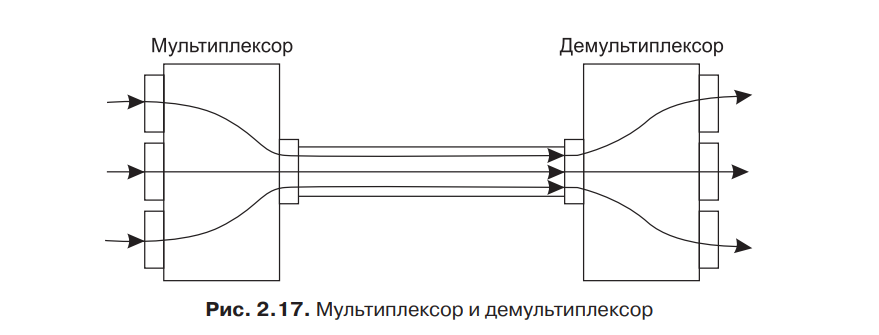

**Разделяемой средой (shared medium)** называется физическая среда передачи данных, к которой непосредственно подключено несколько передатчиков узлов сети. Причем в каждый момент времени только один из передатчиков какого-либо узла сети получает доступ к разделяемой среде и использует ее для передачи данных приемнику другого узла, подключенному к этой же среде

### Глава 3. Коммутация каналов и пакетов

#### Коммутация каналов

**Элементарный канал** — это базовая техническая характеристика сети с коммутацией каналов, представляющая собой некоторое фиксированное в пределах данного типа сетей значение пропускной способности. Любая линия связи в сети с коммутацией каналов имеет пропускную способность, кратную элементарному каналу, принятому для данного типа сети.

Для качественной передачи голоса используется частота квантования амплитуды звуковых колебаний в 8000 Гц (дискретизация по времени с интервалом 125 мкс). Для представления амплитуды одного замера чаще всего используется 8 бит кода, что дает 256 градаций звукового сигнала (дискретизация по значениям). В этом случае для передачи одного голосового канала необходима пропускная способность 64 Кбит/c: 8000 × 8 = 64 000 бит/с или 64 Кбит/c. Такой голосовой канал называют **элементарным каналом цифровых телефонных сетей**.

Канал, построенный путем коммутации (соединения) выделенных для информационного потока элементарных каналов, называют **составным каналом**

Подчеркнем следующие свойства составного канала: 

* составной канал на всем своем протяжении состоит из одинакового количества элементарных каналов; 
* составной канал имеет постоянную и фиксированную пропускную способность на всем своем протяжении; 
* составной канал создается временно на период сеанса связи двух абонентов или, другими словами, только на время существования потока; 
* на время сеанса связи все элементарные каналы, входящие в составной канал, поступают в исключительное пользование абонентов, для которых был создан этот составной канал; 
* в течение всего сеанса связи абоненты могут посылать в сеть данные со скоростью, не превышающей пропускную способность составного канала; 
* данные, поступившие в составной канал, гарантированно доставляются вызываемому абоненту без задержек, потерь и с той же скоростью (скоростью источника) вне зависимости от того, существуют ли в это время в сети другие соединения или нет; 
* после окончания сеанса связи элементарные каналы, входившие в соответствующий составной канал, объявляются свободными и возвращаются в пул распределяемых ресурсов для использования другими абонентами

#### Коммутация пакетов

Важнейшим принципом функционирования сетей с коммутацией пакетов является представление информации, передаваемой по сети, в виде структурно отделенных друг от друга порций данных, называемых **пакетами**.

Каждый пакет снабжен **заголовком**, в котором содержится адрес назначения и другая вспомогательная информация (длина поля данных, контрольная сумма и др.), используемая для доставки пакета адресату. Наличие адреса в каждом пакете является одной из важнейших особенностей техники коммутации пакетов, так как каждый пакет может быть обработан коммутатором независимо от других пакетов, составляющих сетевой трафик. Помимо заголовка у пакета может иметься еще одно дополнительное поле, размещаемое в конце пакета и поэтому называемое **концевиком**. В концевике обычно помещается **контрольная сумма**, которая позволяет проверить, была ли искажена информация при передаче через сеть или нет.

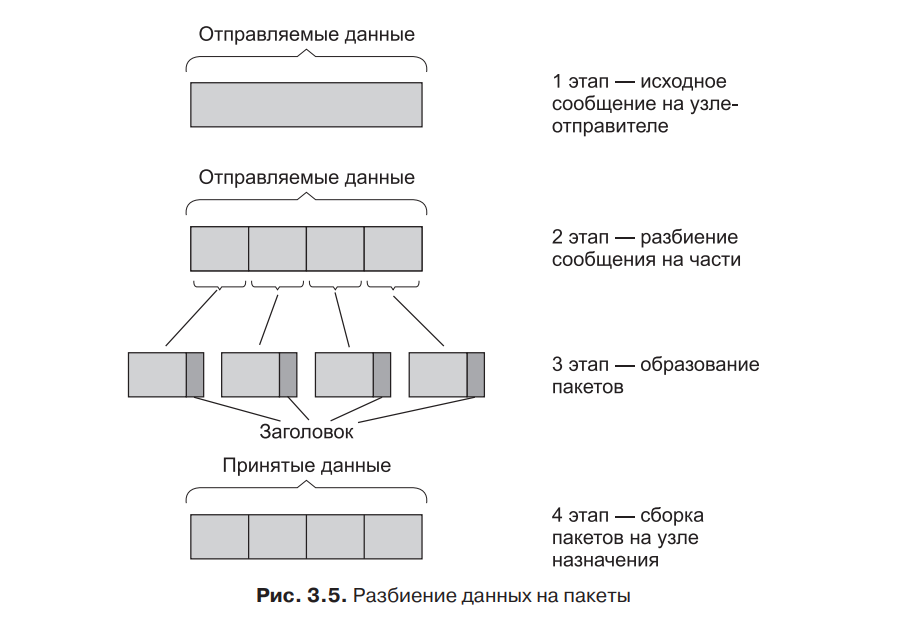

Главное отличие пакетных коммутаторов от коммутаторов в сетях с коммутацией каналов состоит в том, что они имеют внутреннюю **буферную память** для временного хранения пакетов

**Дейтаграммный способ передачи данных** основан на том, что все передаваемые пакеты продвигаются (передаются от одного узла сети другому) независимо друг от друга на основании одних и тех же правил. Никакая информация об уже переданных пакетах сетью не хранится и в ходе обработки очередного пакета во внимание не принимается. То есть каждый отдельный пакет рассматривается сетью как совершенно независимая единица передачи — **дейтаграмма**.

Процедура согласования двумя конечными узлами сети некоторых параметров процесса обмена пакетами называется **установлением логического соединения**. Параметры, о которых договариваются два взаимодействующих узла, называются **параметрами логического соединения**.

Единственный заранее проложенный фиксированный маршрут, соединяющий конечные узлы в сети с коммутацией пакетов, называют **виртуальным каналом** (virtual circuit, или virtual channel).

#### Сравнение коммутации каналов и пакетов

### Глава 4. Стандартизация и классификация сетей

#### Модель OSI

Модель OSI имеет дело со стеком протоколов для сетей с коммутацией пакетов. Модель OSI не содержит описаний реализаций конкретного набора протоколов. Она лишь определяет, вопервых, уровни взаимодействия, во-вторых, стандартные названия уровней, в-третьих, функции, которые должен выполнять каждый уровень.

В модели OSI средства взаимодействия делятся на семь уровней: 

1) прикладной (application layer) 
2) представления (presentation layer) 
3) сеансовый (session layer) 
4) транспортный (transport layer) 
5) сетевой (network layer) 
6) канальный (data link layer) 
7) физический (physical layer)

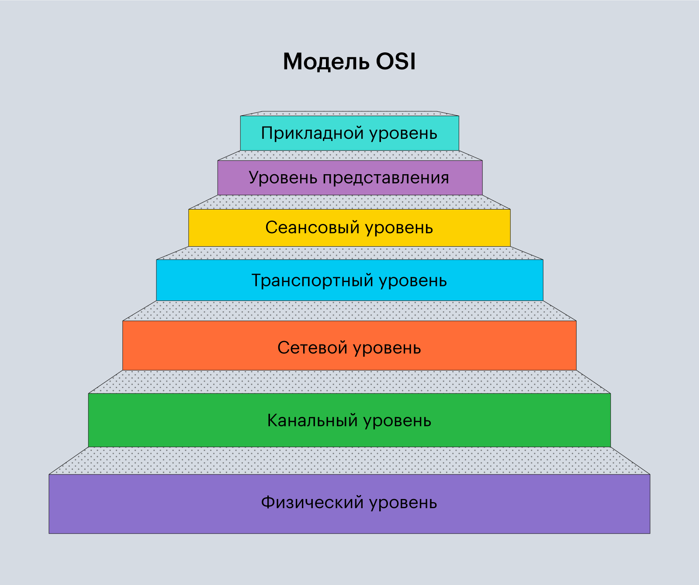

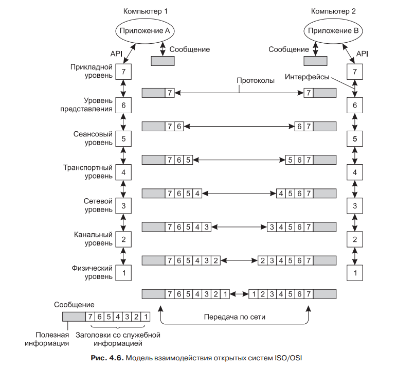

##### Физический уровень

**Физический уровень** модели OSI имеет дело с передачей потока битов по физическим каналам связи, таким как коаксиальный кабель, витая пара, оптоволоконный кабель или беспроводная линия связи.  Функции физического уровня реализуются на всех устройствах, подключенных к сети. Со стороны компьютера эти функции выполняются сетевым адаптером, со стороны промежуточных сетевых устройств — коммутаторов, маршрутизаторов, мультиплексоров и др. — входными и выходными интерфейсами (портами). Физический уровень не вникает в смысл информации, которую он передает. Для него информация, поступающая от вышележащего канального уровня, представляет собой однородный поток битов, которые нужно доставить без искажений, в соответствии с заданной тактовой частотой (интервалом между соседними битами) и выбранным способом кодирования. Примером стандарта физического уровня может служить спецификация Gigabit Ethernet, которая определяет в качестве используемого кабеля неэкранированную витую пару категории 5 с волновым сопротивлением 100 Ом, разъемом типа RJ-45, максимальной длиной физического сегмента не более 100 м, манчестерским кодом для представления данных в кабеле, а также некоторые другие характеристики среды и электрических сигналов. Протокольной единицей данных физического уровня является **бит**.

##### Канальный уровень

**Канальный уровень**, используя возможности, предоставляемые ему нижележащим, физическим, уровнем, предлагает вышележащему, сетевому, уровню следующие услуги: 

* установление логического соединения между взаимодействующими узлами; 
* согласование в рамках соединения скоростей передатчика и приемника информации;  
* обеспечение надежной передачи, обнаружение и коррекцию ошибок. 

В сетях, построенных на основе разделяемой среды, физический уровень выполняет еще одну функцию — проверяет доступность разделяемой среды. Эту функцию иногда выделяют в отдельный подуровень управления доступом к среде (Medium Access Control, MAC). Протокол канального уровня обычно работает в пределах сети, являющейся одной из частей более крупной составной сети, объединенной протоколами сетевого уровня. Адреса, с которыми работает протокол канального уровня, используются для доставки кадров только в пределах этой сети, а для перемещения пакетов между сетями применяются адреса уже следующего, **сетевого уровня**. Протоколы канального уровня реализуются как на конечных узлах (средствами сетевых адаптеров и их драйверов), так и на всех промежуточных сетевых устройствах (коммутаторах, маршрутизаторах и др.). 

Протокольной единицей данных канального уровня является **кадр**. 

В поле данных кадра размещается сообщение сетевого уровня, а в заголовке — служебная информация, включающая адрес назначения, на основании которого коммутаторы сети будут продвигать пакет. Одной из задач канального уровня является обнаружение и коррекция ошибок. Канальный уровень может обеспечить надежность передачи, например, путем фиксирования границ кадра, помещая специальную последовательность битов в его начало и конец, а затем добавляя к кадру контрольную сумму. Контрольная сумма вычисляется по некоторому алгоритму как функция от всех байтов кадра. На стороне получателя канальный уровень группирует биты, поступающие с физического уровня, в кадры, снова вычисляет контрольную сумму полученных данных и сравнивает результат с контрольной суммой, переданной в кадре. Если они совпадают, то кадр считается правильным. Если же контрольные суммы не совпадают, то фиксируется ошибка. 

В функции канального уровня входит не только обнаружение ошибок, но и их исправление за счет повторной передачи поврежденных кадров в рамках логического соединения. Однако эта функция не является обязательной и в некоторых реализациях канального уровня она отсутствует — например, в Ethernet. Прежде чем переправить кадр физическому уровню для непосредственной передачи данных в сеть, подуровень MAC канального уровня должен проверить доступность среды. Если разделяемая среда освободилась (когда она не используется, такая проверка пропускается), то кадр передается средствами физического уровня в сеть. В локальных сетях канальный уровень поддерживает весьма мощный и законченный набор функций по пересылке сообщений между узлами сети. В некоторых случаях протоколы канального уровня локальных сетей оказываются самодостаточными транспортными средствами и могут допускать работу непосредственно поверх себя протоколов прикладного уровня или приложений без привлечения средств сетевого и транспортного уровней. Тем не менее для качественной передачи сообщений в сетях с произвольной топологией функций канального уровня оказывается недостаточно.

##### Сетевой уровень

**Сетевой уровень** служит для образования единой транспортной системы, объединяющей несколько сетей и называемой **составной сетью**, или **интернетом**.

Одной из функций **маршрутизатора** является физическое соединение сетей. Маршрутизатор имеет несколько сетевых интерфейсов, подобных интерфейсам компьютера, к каждому из которых может быть подключена одна сеть. Таким образом, интерфейсы маршрутизатора можно считать узлами разных сетей. Маршрутизатор может быть реализован программно на базе универсального компьютера . Однако чаще маршрутизаторы реализуются на базе специализированных аппаратных платформ. В состав программного обеспечения маршрутизатора входят протокольные модули сетевого уровня.

Данные, которые необходимо передать через составную сеть, поступают на сетевой уровень от вышележащего транспортного уровня. Эти данные снабжаются заголовком сетевого уровня. Данные вместе с заголовком образуют **пакет** — так называется протокольная единица данных сетевого уровня.

*Определение маршрута* является важной задачей сетевого уровня. Маршрут описывается последовательностью сетей (или маршрутизаторов), через которые должен пройти пакет, чтобы попасть к адресату. Например, на рис. 4.8 штриховой линией показано три маршрута, по которым могут быть переданы данные от компьютера А к компьютеру Б. Маршрутизатор собирает информацию о топологии связей между сетями и на основе этой информации строит таблицы коммутации, которые в данном случае носят специальное название **таблиц маршрутизации**.

##### Транспортный уровень

**Транспортный уровень** обеспечивает приложениям и верхним уровням стека — прикладному, представления и сеансовому — передачу данных с той степенью надежности, которая им требуется. 

Все протоколы, начиная с транспортного уровня и выше, реализуются *программными средствами конечных узлов сети* — компонентами их сетевых операционных систем. В качестве примера транспортных протоколов можно привести протоколы TCP и UDP стека TCP/IP и протокол SPX стека Novell.

##### Сеансовый уровень

**Сеансовый уровень** управляет взаимодействием сторон: фиксирует, какая из сторон является активной в настоящий момент, и предоставляет средства синхронизации сеанса. Эти средства позволяют в ходе длинных передач сохранять информацию о состоянии этих передач в виде контрольных точек, чтобы в случае отказа можно было вернуться назад к последней контрольной точке, а не начинать все с начала. На практике немногие приложения используют сеансовый уровень, который редко реализуется в виде отдельных протоколов. Функции этого уровня часто объединяют с функциями прикладного уровня и реализуют в одном протоколе.

#####  Уровень представления

**Уровень представления**, как явствует из его названия, обеспечивает представление передаваемой по сети информации, не меняя при этом ее содержания. За счет уровня представления информация, передаваемая прикладным уровнем одной системы, всегда понятна прикладному уровню другой системы. С помощью средств данного уровня протоколы прикладных уровней могут преодолеть синтаксические различия в представлении данных или же различия в кодах символов, например кодов ASCII и EBCDIC. На этом уровне могут выполняться шифрование и дешифрование данных, благодаря которым секретность обмена данными обеспечивается сразу для всех прикладных служб. Примером такого протокола является протокол SSL (Secure Socket Layer), который обеспечивает секретный обмен сообщениями для протоколов прикладного уровня стека TCP/IP. Для повышения эффективности обмена текстами и графическими изображениями уровень представления может оказывать услуги по сжатию/распаковке информации. К функциям уровня представления относится также кодирование графических изображений, аудио и видео в соответствии с различными стандартами, например JPEG, MPEG, TIFF.

#####  Прикладной уровень

В качестве функций **прикладного уровня** модель OSI определяет предоставление разнообразных услуг пользовательским приложениям — таких, как доступ к общим сетевым ресурсам (файлам, принтерам или веб-страницам) или распределенным сетевым сервисам (электронной почте, службам передачи сообщений, базам данных). Как правило, услуги прикладного уровня включают идентификацию и аутентификацию участников сетевого взаимодействия, проверку их доступности и полномочий, определение требований к защищенности сеанса обмена и т. д. 

Для запросов к прикладному уровню используются системные вызовы операционной системы, образующие прикладной программный интерфейс (API). Операционная система выполняет процедуры доступа к услугам прикладного уровня прозрачным для приложений образом, экранируя их от всех деталей устройства транспортной подсистемы сети, а также работы сеансового и представительского уровней.

## Часть 3. Технология Ethernet

### Глава 10. Ethernet в локальных сетях

#### Формат кадров технологии Ethernet

Существует несколько стандартов формата кадра Ethernet. На практике в оборудовании Ethernet используется только один формат кадра, а именно — кадр Ethernet DIX, называемый иногда кадром Ethernet II по номеру последнего стандарта DIX.

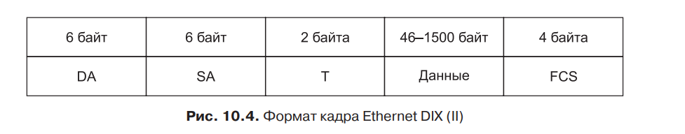

Первые два поля заголовка отведены под адреса: 

**DA (Destination Address)** — MAC-адрес узла назначения; 

**SA (Source Address)** — MAC-адрес узла отправителя. Для доставки кадра достаточно одного адреса — адреса назначения; адрес источника помещается в кадр для того, чтобы узел, получивший кадр, знал, от кого пришел кадр и кому нужно на него ответить. Принятие решения об ответе не входит в компетенцию протокола Ethernet — это дело протоколов верхних уровней, а Ethernet выполнит такое действие, если с сетевого уровня поступит соответствующее указание. 

Поле **T (Type, EtherType)** содержит условный код протокола верхнего уровня, данные которого находятся в поле данных кадра, например, шестнадцатеричное значение 08-00 соответствует протоколу IP. Это поле требуется для поддержки интерфейсных функций мультиплексирования и демультиплексирования кадров при взаимодействии с протоколами верхних уровней. 

Поле **данных** может содержать от 46 до 1500 байт. Если длина пользовательских данных меньше 46 байт, то это поле дополняется до минимального размера байтами заполнения. Эта операция требуется для корректной работы метода доступа Ethernet (см. следующий раздел). 

Поле **контрольной последовательности кадра (Frame Check Sequence, FCS)** состоит из 4 байт контрольной суммы. Это значение вычисляется по алгоритму CRC-32. Кадр Ethernet DIX (II) не отражает разделения канального уровня Ethernet на уровни МАС и LLC: его поля поддерживают функции обоих уровней, например, интерфейсные функции поля T относятся к функциям уровня LLC, в то время как все остальные поля поддерживают функции уровня MAC. Существуют и еще три стандартных формата кадра Ethernet, описание которых можно найти на сайте.

#### Доступ к среде и передача данных

Метод доступа, используемый в сетях Ethernet на разделяемой проводной среде, носит название CSMA/CD (Carrier Sense Multiple Access with Collision Detection — прослушивание несущей частоты с множественным доступом и распознаванием коллизий). Название метода достаточно хорошо отражает его особенности. Все компьютеры в сети на разделяемой среде имеют возможность немедленно (с учетом задержки распространения сигнала в физической среде) получить данные, передаваемые любым из компьютеров в общую среду. Говорят, что среда, к которой подключены все станции, работает в режиме **коллективного доступа (Multiply Access, MA)**. Чтобы получить возможность передавать кадр, интерфейс-отправитель должен убедиться, что разделяемая среда свободна. Это достигается прослушиванием основной гармоники сигнала, которая еще называется **несущей частотой (Carrier Sense, CS)**. Признаком «незанятости» среды является отсутствие на ней несущей частоты, которая при манчестерском способе кодирования и тактовой частоте 10 МГц равна 5–10 МГц в зависимости от последовательности единиц и нулей, передаваемых в данный момент. Если среда свободна, то узел имеет право начать передачу кадра. В примере, показанном на рис. 10.5, узел 1 обнаружил, что среда свободна, и начал передавать свой кадр. В коаксиальном кабеле сигналы передатчика узла 1 распространяются в обе стороны, так что их получают все узлы сети. Кадр данных всегда сопровождается **преамбулой**, которая состоит из 7 байт, каждый из которых имеет значение 10101010, и 8-го байта, равного 10101011. Последний байт носит название **ограничителя начала кадра**. Преамбула нужна для вхождения приемника в побитовую и побайтовую синхронизацию с передатчиком. Наличие двух последовательных единиц говорит приемнику о том, что преамбула закончилась и следующий бит является началом кадра.

Все станции, подключенные к кабелю, начинают записывать байты передаваемого кадра в свои внутренние буферы. Первые 6 байт кадра содержат адрес назначения. Та станция, которая узнает собственный адрес в заголовке кадра, продолжает записывать его содержимое в свой внутренний буфер, а остальные станции на этом прием кадра прекращают. Станция назначения обрабатывает полученные данные и передает их вверх по своему стеку. Кадр Ethernet содержит не только адрес назначения, но и адрес источника данных, поэтому станция-получатель знает, кому нужно послать ответ. Узел 2 во время передачи кадра узлом 1 также пытался начать передачу своего кадра, однако, обнаружив, что среда занята — на ней присутствует несущая частота, — вынужден ждать, пока узел 1 не прекратит передачу кадра.

После окончания передачи кадра все узлы сети обязаны выдержать технологическую паузу, равную **межпакетному интервалу (Inter Packet Gap, IPG)** в 9,6 мкс. Эта пауза нужна для приведения сетевых адаптеров в исходное состояние, а также для предотвращения монопольного захвата среды одной станцией. После окончания технологической паузы узлы имеют право начать передачу своего кадра, так как среда свободна. В приведенном примере узел 2 дождался окончания передачи кадра узлом 1, сделал паузу в 9,6 мкс и начал передачу своего кадра.

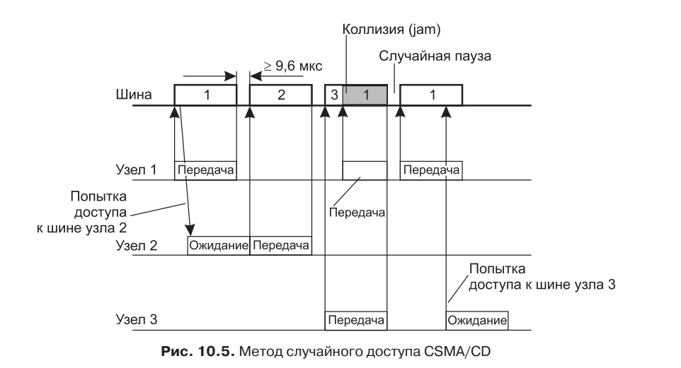

#### Возникновение и распознавание коллизии

Механизм прослушивания среды и пауза между кадрами не гарантируют исключения ситуации, когда две или более станции одновременно решают, что среда свободна, и начинают передавать свои кадры. Говорят, что при этом происходит **коллизия**, так как содержимое обоих кадров сталкивается в общем кабеле и происходит искажение информации. Коллизия — это нормальная ситуация в работе сетей Ethernet на разделяемой среде. В примере на рис. 10.6 коллизию породила одновременная передача данных узлами 3 и 1. Для возникновения коллизии не обязательно, чтобы несколько станций начали передачу *абсолютно* одновременно — напротив, более вероятна ситуация, когда один узел начинает передачу, а через некоторое (короткое) время другой узел, проверив среду и не обнаружив несущую (сигналы первого узла еще не успели до него дойти), начинает передачу своего кадра. Таким образом, возникновение коллизии — следствие распределения узлов сети в пространстве.

Для корректной обработки коллизии все станции одновременно наблюдают за возникающими на кабеле сигналами. Если передаваемые и наблюдаемые сигналы отличаются, то фиксируется факт **обнаружения коллизии (Collision Detection, CD)**. Для повышения вероятности скорейшего обнаружения коллизии всеми станциями сети станция, обнаружившая коллизию, прерывает передачу своего кадра (в произвольном месте, возможно, и не на границе байта), усугубляя коллизию посылкой в сеть последовательности из 32 бит, называемой **jam-последовательностью**. Затем обнаружившая коллизию передающая станция обязана прекратить передачу, сделать паузу в течение короткого случайного интервала времени, после чего снова предпринять попытку захвата среды и передачи кадра. Если 16 последовательных попыток передачи кадра вызывают коллизию, то передатчик должен прекратить попытки и отбросить этот кадр.

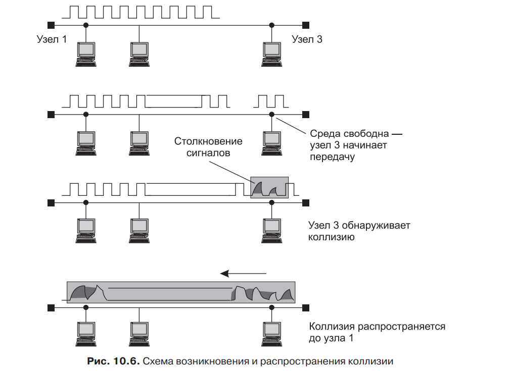

Надежное распознавание коллизий всеми станциями сети — необходимое условие корректной работы сети Ethernet. Для надежного распознавания коллизий должно выполняться соотношение:
$$T_{min} ≥ RTT$$ Где $T_{min}$ — время передачи кадра минимальной длины, а $RTT$ — время оборота, то есть время, за которое сигнал, посланный некоторой станцией сети, доходит то точки коллизии
и возвращается к станции-отправителю в уже искаженной коллизией форме. В худшем случае сигнал должен пройти дважды между наиболее удаленными друг от друга станциями сети. При выполнении этого условия передающая станция должна успеть обнаружить коллизию, которую вызвал переданный ею кадр, еще до окончания передачи этого кадра. Очевидно, что выполнение условия зависит, с одной стороны, от минимальной длины кадра и скорости передачи данных протокола, а с другой — от длины кабельной системы сети и скорости распространения сигнала в кабеле (для разных типов кабеля эта скорость несколько отличается).

Все параметры протокола Ethernet, в том числе минимальный размер кадра, подобраны таким образом, чтобы при нормальной работе сети коллизии четко распознавались. Так, стандарт Ethernet определяет минимальную длину поля данных кадра в 46 байт (что вместе со служебными полями дает минимальную длину кадра 64 байта, а вместе с преамбулой — 72 байта, или 576 бит).

Отсюда может быть вычислено ограничение на расстояние между станциями. В стандарте Ethernet 10 Мбит/с время передачи кадра минимальной длины равно 575 битовым интервалам, следовательно, время оборота должно быть меньше 57,5 мкс. Расстояние, которое сигнал может пройти за это время, зависит от типа кабеля и для толстого коаксиального кабеля равно примерно 13 280 м. Учитывая, что за время 57,5 мкс сигнал должен пройти по линии связи дважды, расстояние между двумя узлами не должно быть больше 6635 м. В стандарте величина этого расстояния выбрана равной 2500 м, что существенно меньше. Это объясняется тем, что в сети могут использоваться повторители, которые нужны для соединения отдельных сегментов кабеля, внося задержки в распространение сигнала.

Требование $T_{min} ≥ RTT$ имеет одно интересное следствие: чем выше скорость протокола, тем меньше должна быть максимальная длина сети. Поэтому для Ethernet на разделяемой среде при скорости в 100 Мбит/c максимальная длина сети пропорционально уменьшается до 250 м, а при скорости в 1 Гбит/c — до 25 м. Эта зависимость, наряду с резким ростом задержек при повышении загрузки сети, говорит о коренном недостатке как метода доступа CSMA/CD в частности, так и принципа разделяемой среды в целом.

#### Физические стандарты 10М Ethernet

При первоначальной стандартизации технологии Ethernet рабочей группой IEEE 802.3 был выбран вариант Ethernet на «толстом» коаксиальном кабеле, который получил название 10Base-5. Число 10 в этом названии обозначает номинальную битовую скорость передачи данных стандарта, то есть 10 Мбит/с, а слово «Base» — метод передачи на одной базовой частоте (в данном случае — 10 МГц). Последний символ в названии стандарта физического уровня обозначает тип кабеля, в данном случае «5» отражает тот факт, что диаметр «толстого» коаксиала равен 0,5 дюйма.

В качестве метода кодирования сигналов был выбран манчестерский код. Затем сети Ethernet на «толстом» коаксиальном кабеле были вытеснены сетями на более «тонком» коаксиале (диаметром 0,25 дюйма, что отражает название 10Base-2 этого стандарта), который позволял строить сети более экономичным способом. Однако сети Ethernet на коаксиальном кабеле обладали одним существенным недостатком — отсутствием оперативной информации о состоянии кабеля и сложностью нахождения места его повреждения, поэтому поиск неисправностей стал привычной процедурой и головной болью многочисленной армии сетевых администраторов коаксиальных сетей Ethernet.

Альтернатива появилась в середине 80-х, когда благодаря использованию витой пары и повторителей сети Ethernet стали гораздо более ремонтопригодными. К этому времени телефонные компании уже достаточно давно применяли многопарный кабель на основе неэкранированной витой пары для подключения телефонных аппаратов внутри зданий. Идея приспособить этот популярный вид кабеля для локальных сетей оказалась очень плодотворной — многие здания уже были оснащены нужной кабельной системой. Оставалось разработать способ подключения сетевых адаптеров и прочего коммуникационного оборудования к витой паре таким образом, чтобы минимизировать изменения в сетевых адаптерах и программном обеспечении сетевых операционных систем по сравнению с сетями Ethernet на коаксиале. Эта попытка оказалась успешной — переход на витую пару требует только замены приемника и передатчика сетевого адаптера, а метод доступа и все протоколы канального уровня остаются теми же, что и в сетях Ethernet на коаксиале. Результат реализации этой идеи — стандарт 10Base-T (T — от Twisted pair). Правда, для соединения узлов в сеть теперь обязательно требуется коммуникационное устройство — **многопортовый повторитель** Ethernet на витой паре.

Повторитель побитно принимает сигналы от одного из конечных узлов и синхронно передает их на все свои остальные порты, исключая тот, с которого поступили сигналы, одновременно улучшая их электрические характеристики. Многопортовый повторитель часто называют **концентратором**, или **хабом** (от англ. hub — центр, ступица колеса), так как в нем сконцентрированы соединения со всеми конечными узлами сети. Фактически хаб имитирует сеть на коаксиальном кабеле в том отношении, что физически отдельные отрезки кабеля на витой паре логически все равно представляют единую разделяемую среду.

Все правила доступа к среде по алгоритму CSMA/CD сохраняются. При создании сети Ethernet на витой паре с большим числом конечных узлов хабы можно соединять друг с другом иерархически, образуя древовидную структуру. Добавление каждого хаба изменяет физическую структуру, оставляя без изменения логическую структуру сети. То есть независимо от числа хабов в сети сохраняется одна общая для всех интерфейсов разделяемая среда, так что передача кадра с любого интерфейса блокирует передатчики всех остальных интерфейсов.

Физическая структуризация сетей, построенных на основе витой пары, повысила надежность сетей Ethernet, поскольку в этом случае возможно контролировать состояние и локализовать отказы отдельных кабельных отрезков, подключающих конечные узлы к концентраторам. В случае обрыва, короткого замыкания или неисправности сетевого адаптера работа сети может быть быстро восстановлена путем отключения соответствующего сегмента кабеля. Но физическая структуризация не избавила Ethernet от ограничений по диаметру сети и количеству узлов, определяемых необходимостью распознавания коллизий. Дальнейший прогресс Ethernet требовал принципиально иного решения, которое нашлось в виде коммутируемого Ethernet.

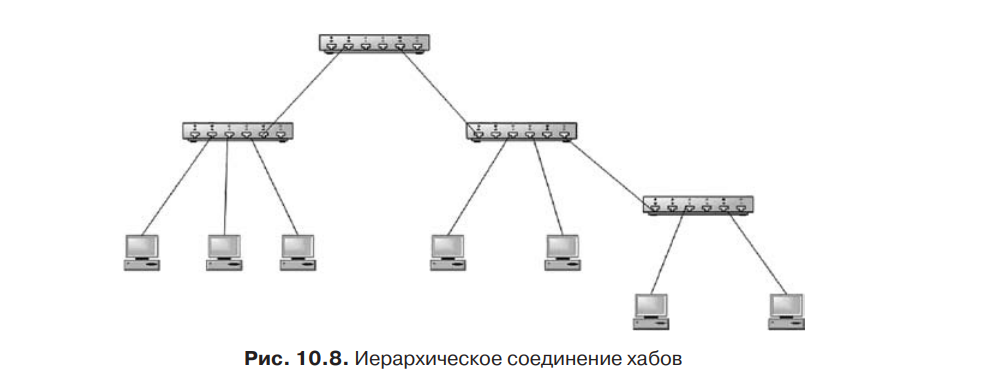

#### Мост как предшественник  и функциональный аналог коммутатора 

**Мост локальной сети (LAN bridge)**, или просто **мост**, появился как средство построения крупных локальных сетей на разделяемой среде. Мост объединяет две или более разделяемые среды в единую сеть, при этом передача кадров между узлами каждой из объединяемых сред происходит по стандартным правилам изолированной разделяемой среды. Мост отвечает только за передачу кадров между объединенными средами, которые называются **сегментами локальной сети**.

	Мост выполняет логическую структуризацию сети, то есть разделяет разделяемую среду на несколько сегментов и соединяет полученные сегменты, при этом мост не передает данные между сегментами побитно, как повторитель, а буферизует кадры и передает их затем в тот или иной сегмент (или сегменты) в зависимости от адреса назначения кадра.

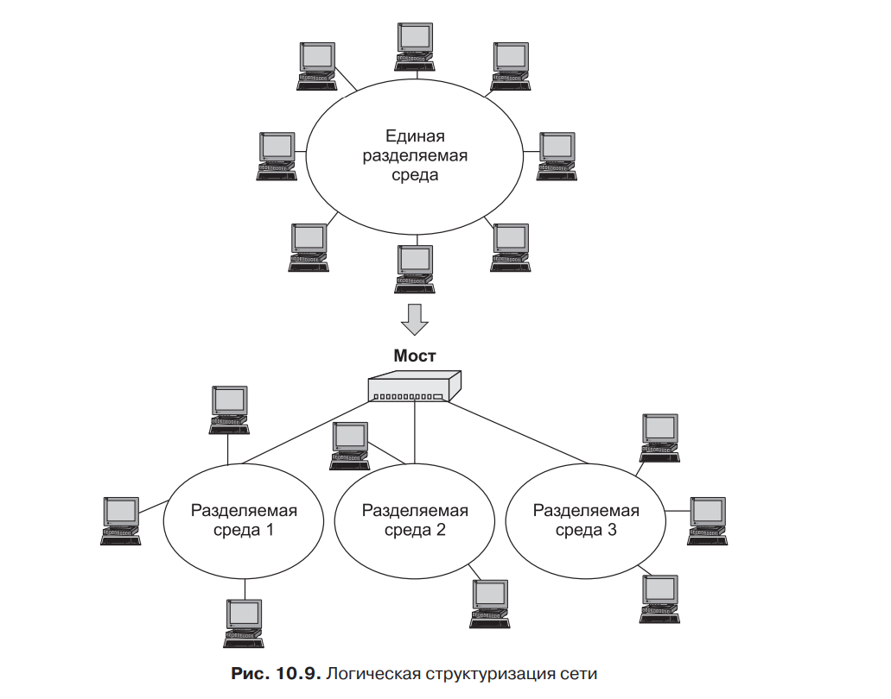

Как мосты, так и коммутаторы продвигают кадры на основании одного и того же алгоритма, а именно — **алгоритма прозрачного моста**, описанного в стандарте IEEE 802.1D. Слово «прозрачный» в названии алгоритм прозрачного моста отражает тот факт, что конечные узлы сети функционируют, «не замечая» присутствия в сети мостов. Так как алгоритм прозрачного моста остался единственным актуальным алгоритмом мостов, то в дальнейшем мы будем опускать термин «прозрачный», подразумевая именно этот тип алгоритма работы моста/коммутатора. Мост строит свою таблицу продвижения (адресную таблицу) на основании пассивного наблюдения за трафиком, циркулирующим в подключенных к его портам сегментах, учитывая адреса источников кадров данных, поступающих на его порты. По адресу источника кадра мост делает вывод о принадлежности узла-источника тому или иному сегменту сети.

Рассмотрим процесс автоматического создания таблицы продвижения моста и ее использования на примере простой сети, представленной на рис. 10.10

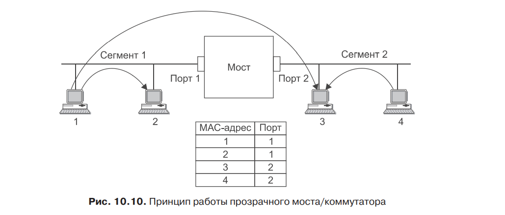

Мост соединяет два сетевых сегмента. Сегмент 1 составляют компьютеры, подключенные с помощью одного отрезка коаксиального кабеля к порту 1 моста, а сегмент 2 — компьютеры, подключенные с помощью другого отрезка коаксиального кабеля к порту 2 моста. В исходном состоянии мост не знает о том, компьютеры с какими MAC-адресами подключены к каждому из его портов. В этой ситуации мост просто передает любой захваченный и буферизованный кадр на все свои порты за исключением того порта, от которого этот кадр получен. В нашем примере у моста только два порта, поэтому он передает кадры с порта 1 на порт 2 и наоборот. Отличие работы моста в этом режиме от повторителя — в том, что он передает кадр, предварительно буферизуя его, а не бит за битом, как это делает повторитель. Буферизация отменяет логику работы всех сегментов как единой разделяемой среды. Когда мост собирается передать кадр с сегмента на сегмент, например, с сегмента 1 на сегмент 2, он, как обычный конечный узел, пытается получить доступ к разделяемой среде сегмента 2 по правилам алгоритма доступа, в данном примере — по правилам алгоритма CSMA/CD. Одновременно с передачей кадра на все порты мост изучает адрес источника кадра и делает запись о его принадлежности к тому или иному сегменту в своей **адресной таблице**. Эту таблицу также называют **таблицей фильтрации** или **продвижения**. 

Например, получив на порт 1 кадр от компьютера 1, мост делает первую запись в своей адресной таблице: 

							MAC-адрес 1 — порт 1. 

Эта запись означает, что компьютер, имеющий MAC-адрес 1, принадлежит сегменту, подключенному к порту 1 коммутатора. Если все четыре компьютера данной сети проявляют активность и посылают друг другу кадры, то скоро мост построит полную адресную таблицу сети из четырех записей — по одной записи на узел (см. рис. 10.10). При каждом поступлении кадра на порт моста он прежде всего пытается найти адрес назначения кадра в адресной таблице. Продолжим рассмотрение действий моста на примере рис. 10.10

1. При получении кадра, направленного от компьютера 1 компьютеру 3, мост просматривает адресную таблицу на предмет совпадения адреса в какой-либо из ее записей с адресом назначения — MAC-адресом 3. Запись с искомым адресом имеется в адресной таблице. 
2. Далее мост выполняет второй этап анализа таблицы — проверяет, находятся ли компьютеры с адресами источника и назначения в одном сегменте. В примере компьютер 1 (MAC-адрес 1) и компьютер 3 (MAC-адрес 3) находятся в разных сегментах. Следовательно, мост выполняет операцию **продвижения (forwarding)** кадра — передает кадр на порт 2, ведущий в сегмент получателя, получает доступ к сегменту и передает туда кадр. 
3. Если бы оказалось, что компьютеры принадлежали одному сегменту, то кадр просто был бы удален из буфера. Такая операция называется **фильтрацией (filtering)**. 
4. Если бы запись о MAC-адресе 3 отсутствовала в адресной таблице, то есть, другими словами, адрес назначения был неизвестен мосту, то он передал бы кадр на все свои порты, кроме порта — источника кадра, как и на начальной стадии процесса обучения.

Процесс обучения моста никогда не заканчивается и происходит одновременно с продвижением и фильтрацией кадров. Мост постоянно следит за адресами источника буферизуемых кадров, чтобы автоматически приспосабливаться к изменениям, происходящим в сети, — перемещениям компьютеров из одного сегмента сети в другой, отключению и появлению новых компьютеров.

Входы адресной таблицы могут быть динамическими, создаваемыми в процессе самообучения моста, и статическими, создаваемыми вручную администратором сети. **Статические записи** не имеют срока жизни, что дает администратору возможность влиять на работу моста, например, ограничивая передачу кадров с определенными адресами из одного сегмента в другой.

**Динамические записи** имеют срок жизни — при создании или обновлении записи в адресной таблице с ней связывается отметка времени. По истечении определенного тайм-аута запись помечается как недействительная, если за это время мост не принял ни одного кадра с данным адресом в поле адреса источника. Это дает возможность мосту автоматически реагировать на перемещения компьютера из сегмента в сегмент — при его отключении от старого сегмента запись о принадлежности компьютера к этому сегменту со временем вычеркивается из адресной таблицы. После подключения компьютера к другому сегменту его кадры начнут попадать в буфер моста через другой порт, а в адресной таблице появится новая запись, соответствующая текущему состоянию сети.

#### Коммутаторы

При появлении на рубеже 1980-х — 1990-х годов быстрых протоколов, производительных персональных компьютеров, мультимедийной информации и разделении сети на большое количество сегментов классические мосты перестали справляться с работой. Обслуживание потоков кадров уже несколькими портами с помощью одного процессорного блока требовало значительного повышения быстродействия процессора, что довольно дорого. 

Более эффективным оказалось решение, которое и «породило» коммутаторы: для обслуживания потока, поступающего на каждый порт, в устройство ставился отдельный специализированный процессор, который реализовывал алгоритм прозрачного моста. По сути, коммутатор — это мультипроцессорный мост, способный параллельно продвигать кадры сразу между всеми парами своих портов. Но если при добавлении процессорных блоков компьютер не перестали называть компьютером, а добавили только прилагательное «мультипроцессорный», то с мультипроцессорными мостами произошла метаморфоза — во многом по маркетинговым причинам они превратились в коммутаторы. Нужно отметить, что помимо процессоров портов коммутатор имеет центральный процессор, который координирует работу портов, отвечая за построение общей таблицы продвижения, а также поддерживая функции конфигурирования и управления коммутатором.

Технология коммутации сама по себе не имеет непосредственного отношения к методу доступа к среде, который используется портами коммутатора. При подключении к порту коммутатора сегмента, представляющего собой разделяемую среду, данный порт, как и все остальные узлы такого сегмента, должен поддерживать полудуплексный режим. Однако когда к каждому порту коммутатора подключен не сегмент, а только один компьютер, причем по двум физически раздельным каналам, как это происходит почти во всех стандартах Ethernet, кроме коаксиальных версий Ethernet, ситуация становится не такой однозначной. Порт может работать как в обычном полудуплексном режиме, так и в дуплексном.

В **полудуплексном режиме** работы порт коммутатора по-прежнему распознает коллизии. Доменом коллизий в этом случае является участок сети, включающий передатчик и приемник коммутатора, передатчик и приемник сетевого адаптера компьютера, а также две витые пары, соединяющие передатчики с приемниками. Коллизия возникает, когда передатчики порта коммутатора и сетевого адаптера одновременно или почти одновременно начинают передачу своих кадров.

В **дуплексном режиме** одновременная передача данных передатчиком порта коммутатора и сетевого адаптера коллизией не считается — этот режим работы может рассматриваться в качестве штатного для отдельных дуплексных каналов передачи данных, ранее использовавшегося в протоколах глобальных сетей. При дуплексной связи порты Ethernet стандарта 10 Мбит/с могут передавать данные со скоростью 20 Мбит/с — по 10 Мбит/с в каждом направлении.

Долгое время коммутаторы Ethernet сосуществовали в локальных сетях с концентраторами Ethernet: на концентраторах строились нижние уровни сети здания (в частности, сети рабочих групп и отделов), а коммутаторы служили для объединения этих сегментов в общую сеть. Но постепенно коммутаторы стали применяться и на нижних этажах, вытесняя концентраторы, так как цены коммутаторов постоянно снижались, а их производительность росла (за счет поддержки более скоростных версий технологии Ethernet, то есть Fast Ethernet со скоростью 100 Мбит/c, Gigabit Ethernet со скоростью 1 Гбит/с, 10G Ethernet со скоростью 10 Гбит/с и 100G Ethernet со скоростью 100 Гбит/с — эти версии рассматриваются далее в разделе «Скоростные версии Ethernet»). Этот процесс завершился вытеснением концентраторов Ethernet и переходом к полностью коммутируемым сетям (рис. 10.15).

В полностью коммутируемой сети Ethernet все порты работают в дуплексном режиме, а продвижение кадров осуществляется на основе MAC-адресов.

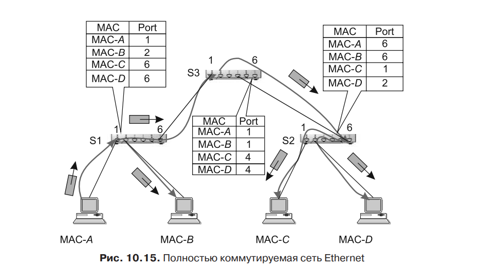

При разработке технологий Fast Ethernet и Gigabit Ethernet дуплексный режим стал одним из двух полноправных стандартных режимов работы узлов сети. Однако практика применения первых коммутаторов с портами Gigabit Ethernet показала, что они практически всегда применяются в дуплексном режиме для взаимодействия с другими коммутаторами или высокоскоростными сетевыми адаптерами. Поэтому при разработке версий стандартов 10G и 100G Ethernet его разработчики не стали создавать версию для работы в полудуплексном режиме, окончательно закрепив уход разделяемой среды из технологии Ethernet.

#### Скоростные версии Ethernet

Скорость 10 Мбит/с первой стандартной версии Ethernet долгое время удовлетворяла потребности пользователей локальных сетей. Однако в начале 90-х стала ощущаться недостаточная пропускная способность Ethernet, так как скорость обмена с сетью стала существенно меньше скорости внутренней шины компьютера. Кроме того, начали появляться новые мультимедийные приложения, гораздо более требовательные к скорости сети, чем их текстовые предшественники. В поисках решения проблемы ведущие производители сетевого оборудования начали интенсивные работы по повышению скорости Ethernet при сохранении главного достоинства этой технологии — простоты и невысокой стоимости оборудования. Результатом стало появление новых скоростных стандартов Ethernet: Fast Ethernet (скорость 100 Мбит/c), Gigabit Ethernet (1000 Мбит/c, или 1 Гбит/c), 10G Ethernet (10 Гбит/c), 100G Ethernet, 200G Ethernet (200 Гбит/c) и 400G Ethernet.

Разработчикам новых скоростных стандартов Ethernet удалось сохранить основные черты классической технологии Ethernet и прежде всего простой способ обмена кадрами без встраивания в технологию сложных контрольных процедур. Этот фактор оказался решающим в соревновании технологий локальных сетей, так как выбор пользователей всегда склонялся в сторону простого наращивания скорости сети, а не в сторону решений, связанных с более эффективным расходованием той же самой пропускной способности с помощью более сложной и дорогой технологии.

Значительный вклад в «победу» Ethernet внесли также коммутаторы локальных сетей, так как их успех привел к отказу от разделяемой среды, где технология Ethernet всегда была уязвимой из-за случайного характера метода доступа. Начиная с версии 10G Ethernet разработчики перестали обеспечивать обратную совместимость с предыдущими вариантами и отказались от поддержки разделяемой среды. Повышение скорости работы Ethernet было достигнуто за счет нескольких факторов:

* улучшение качества кабелей, применяемых в компьютерных сетях; 
* совершенствование методов кодирования данных; 
* использование параллельных потоков данных.

Все отличия скоростных версий Ethernet от классической версии 10М Ethernet проявляются на физическом уровне (рис. 10.16). Уровни MAC и LLC в Fast Ethernet остались абсолютно теми же, и их описывают прежние главы стандартов 802.3 и 802.2. Поэтому, рассматривая очередную версию технологии Ethernet, будем изучать только вариант организации ее физического уровня.

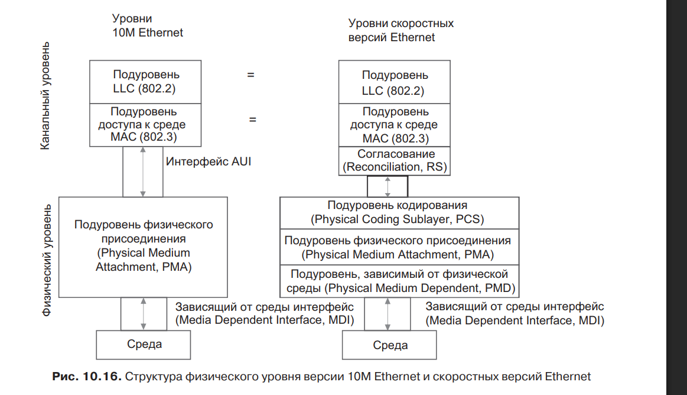

## Часть 4. Сети TCP/IP

### Глава 13. Адресация в стеке протоколов TCP/IP

#### Структура стека протоколов TCP/IP

Сегодня стек TCP/IP широко используется как в глобальных, так и в локальных сетях. Стек имеет иерархическую, четырехуровневую структуру.

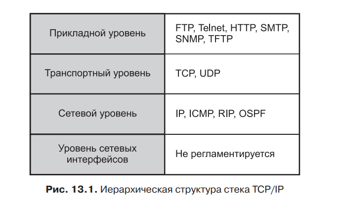

**Прикладной уровень** стека TCP/IP соответствует трем верхним уровням модели OSI: прикладному, представления и сеансовому. Он объединяет сервисы, предоставляемые стеком TCP/IP пользовательским приложениям. К ним относятся протокол передачи файлов (File Transfer Protocol, FTP), протокол эмуляции терминала telnet, простой протокол передачи почты (Simple Mail Transfer Protocol, SMTP), протокол передачи гипертекста (Hypertext Transfer Protocol, HTTP) и многие другие. Протоколы прикладного уровня развертываются на хостах.

**Транспортный уровень** стека TCP/IP может предоставлять вышележащему уровню два типа сервиса: 
* гарантированную доставку обеспечивает протокол управления передачей (Transmission Control Protocol, TCP); 
* доставку по возможности, или с максимальными усилиями, обеспечивает протокол пользовательских дейтаграмм (User Datagram Protocol, UDP).

Чтобы обеспечить надежную доставку данных, протокол TCP предусматривает установление логического соединения. Это позволяет нумеровать пакеты, подтверждать их прием квитанциями, организовывать в случае потери повторные передачи, распознавать и уничтожать дубликаты, доставлять прикладному уровню пакеты в том порядке, в котором они были отправлены. Благодаря этому протоколу объекты на хосте-отправителе и хосте-получателе могут поддерживать обмен данными в дуплексном режиме. TCP дает возможность без ошибок доставить сформированный на одном из компьютеров поток байтов на любой другой компьютер, входящий в составную сеть.

Второй протокол этого уровня, UDP, является простейшим дейтаграммным протоколом, используемым, если задача надежного обмена данными либо вообще не ставится, либо решается средствами более высокого уровня — прикладным уровнем или пользовательскими приложениями.

**Сетевой уровень**, называемый также уровнем Интернета, является стержнем всей архитектуры TCP/IP. Протоколы сетевого уровня поддерживают интерфейс с вышележащим транспортным уровнем, получая от него запросы на передачу данных по составной сети, а также с нижележащим уровнем сетевых интерфейсов, о функциях которого мы расскажем далее.

Основным протоколом сетевого уровня является межсетевой протокол (Internet Protocol, **IP**). В его задачу входит продвижение пакета между сетями — от одного маршрутизатора к другому до тех пор, пока пакет не попадет в сеть назначения. В отличие от протоколов прикладного и транспортного уровней, протокол IP развертывается не только на хостах, но и на всех маршрутизаторах. Протокол IP — это дейтаграммный протокол, работающий без установления соединений по принципу доставки с максимальными усилиями. Такой тип сетевого сервиса называют также «ненадежным».

**Уровень сетевых интерфейсов**. Напомним, нижние уровни модели OSI (канальный и физический) реализуют разнообразный набор функций: доступ к среде передачи, формирование кадров, согласование величин электрических сигналов, кодирование, синхронизация, усиление. Конкретные реализации этих функций составляют суть протоколов физического и канального уровней, таких, например, как Ethernet и PPP. У нижнего уровня стека TCP/IP задача существенно проще — он отвечает только за организацию взаимодействия с подсетями нижележащих технологий, входящими в составную сеть.

Каждый коммуникационный протокол оперирует некоторой единицей передаваемых данных. Названия этих единиц иногда закрепляются стандартом, а чаще просто определяются традицией. В стеке TCP/IP за многие годы его существования образовалась устоявшаяся терминология в этой области.

**Потоком данных**, **информационным потоком** или просто **потоком** называют данные, поступающие от приложений на вход протоколов транспортного уровня — TCP и UDP. Протокол TCP «нарезает» из потока данных **сегменты**. Единицу данных протокола UDP часто называют **дейтаграммой**. Дейтаграмма — это общее название для единиц данных, которыми оперируют протоколы без установления соединений. К таким протоколам относится и протокол IP, поэтому его единицу данных иногда тоже называют дейтаграммой, хотя чаще используется другой термин — **пакет**.

В стеке TCP/IP единицы данных любых технологий, в которые упаковываются IP-пакеты для последующей передачи через сети составной сети, принято называть **кадрами** или **фреймами**. При этом не имеет значения, какое название используется для этой единицы данных в технологии составляющей сети. Для TCP/IP фреймом является и кадр Ethernet, и ячейка ATM, и пакет X.25 в тех случаях, когда они выступают в качестве контейнера, в котором IP-пакет переносится через составную сеть.

#### Типы адресов стека TCP/IP

Для идентификации сетевых интерфейсов используются три типа адресов: 

1) локальные (аппаратные) адреса; 
2) сетевые адреса (IP-адреса); 
3) символьные (доменные) имена.

Например, если в составную сеть включена подсеть Ethernet, то локальными адресами сетевых интерфейсов этой сети для технологии TCP/IP будут соответственно MAC-адреса, а если подсеть ATM — то номера виртуальных каналов.

Чтобы технология TCP/IP могла решать свою задачу объединения сетей, ей необходима собственная глобальная система адресации, позволяющая универсальным и однозначным способом идентифицировать любой интерфейс составной сети. Очевидным решением является нумерация всех подсетей составной сети, а затем нумерация сетевых интерфейсов в пределах каждой из этих подсетей. Пара, состоящая из номера сети и номера узла, отвечает поставленным условиям и может служить в качестве **сетевого адреса**, или **IP-адреса**. Сетевой адрес представляет собой набор чисел, например 192.45.66.17.

Числовое представление сетевого адреса достаточно эффективно для программных и аппаратных средств. Однако пользователи обычно предпочитают работать с более удобными символьными именами компьютеров. Именно с символьными именами вы имеете дело, когда задаете веб-браузеру адрес доступа к тому или иному сайту Интернета. Символьные имена в пределах составной сети строятся по иерархическому признаку. Примером доменного имени может служить имя base2.sales.zil.ru. Символьные имена называют также **доменными именами** или **DNS-именами**.

	Между локальным адресом, доменным именем и IP-адресом, относящимся к одному и тому же сетевому интерфейсу, нет функциональной зависимости, поэтому единственный путь получить отображение адреса одного типа в адрес другого типа — это построить таблицу соответствия.

#### Формат IP-адреса

В заголовке IP-пакета предусмотрены поля для хранения IP-адреса отправителя и IPадреса получателя. Каждое из этих полей имеет фиксированную длину 4 байта (32 бита). Как уже было сказано, IP-адрес состоит из двух логических частей — номера сети и номера узла в сети. Наиболее распространенная форма представления IP-адреса — запись в виде четырех чисел, представляющих значения каждого байта в десятичной форме и разделенных точками, например: 128.10.2.30 Этот же адрес может быть представлен в двоичном формате: 10000000 00001010 00000010 00011110.

Запись адреса не предусматривает специального разграничительного знака между номером сети и номером узла. Вместе с тем при передаче пакета по сети часто возникает необходимость разделить адрес на эти две части. Например, маршрутизация, как правило, осуществляется на основании номера сети, поэтому каждый маршрутизатор, получая пакет, должен прочитать из соответствующего поля заголовка адрес назначения и выделить из него номер сети. Каким образом маршрутизаторы определяют, какая часть из 32 бит, отведенных под IP-адрес, относится к номеру сети, а какая — к номеру узла? Можно предложить несколько вариантов решения этой проблемы.

Простейший из них состоит в использовании **фиксированной границы**. При этом все 32-битное поле адреса заранее делится на две части не обязательно равной, но фиксированной длины, в одной из которых всегда будет размещаться номер сети, в другой — номер узла. Решение очень простое, но хорошее ли? Поскольку поле, которое отводится для хранения номера узла, имеет фиксированную длину, все сети будут иметь одинаковое максимальное число узлов. Если, например, под номер сети отвести один первый байт, то все адресное пространство распадется на сравнительно небольшое ($2^8$) число сетей огромного размера ($2^{24}$ узлов). Если границу передвинуть дальше вправо, то сетей станет больше, но все равно все они будут одинакового размера. Очевидно, что такой жесткий подход не позволяет дифференцированно удовлетворять потребности отдельных предприятий и организаций. Именно поэтому он не нашел применения, хотя и использовался на начальном этапе существования технологии TCP/IP.

Второй подход (RFC 950, RFC 1518) основан на применении **маски**, которая позволяет максимально гибко устанавливать границу между номером сети и номером узла. При таком подходе адресное пространство можно использовать для создания множества сетей разного размера.

	Маска — это число, применяемое в паре с IP-адресом, причем двоичная запись маски содержит непрерывную последовательность единиц в тех разрядах, которые должны в IP-адресе интерпретироваться как номер сети. Граница между последовательностями единиц и нулей в маске соответствует границе между номером сети и номером узла в IP-адресе.

Например, если маска, связываемая с некоторым IP-адресом, имеет вид 1111111111110 0000000000000000000, то номеру сети соответствуют 10 старших разрядов в двоичном представлении данного IP-адреса.

И наконец, способ (RFC 791), основанный на **классах** адресов, представляет собой компромисс по отношению к двум предыдущим: размеры сетей хотя и не могут быть произвольными, как при использовании масок, но и не должны быть одинаковыми, как при установлении фиксированных границ. Вводится пять классов адресов: A, B, C, D, E. Три из них — A, B и C — предназначены для адресации сетей, а два — D и E — имеют специальное назначение. Для каждого класса сетевых адресов определено собственное положение границы между номером сети и номером узла.

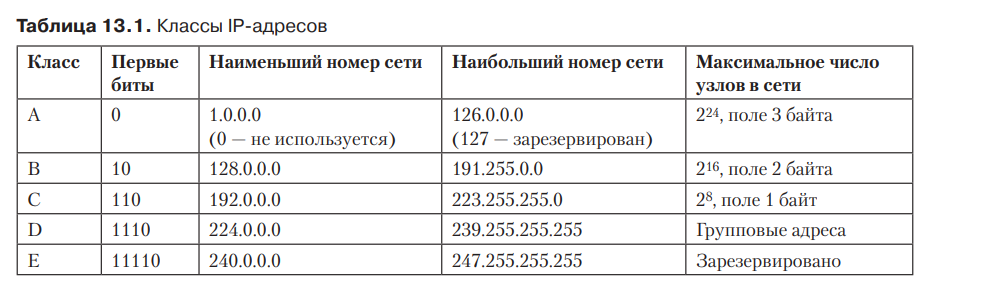

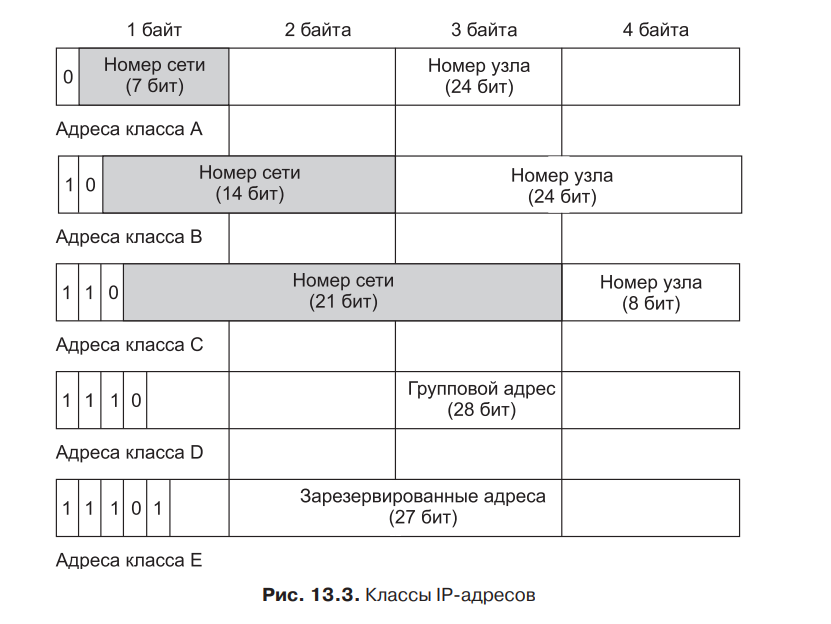

#### Использование масок при IP-адресации

Снабжая каждый IP-адрес маской, можно отказаться от понятий классов адресов и сделать систему адресации более гибкой. 

Пусть, например, для IP-адреса 129.64.134.5 (0000001.01000000.10000110.00000101) указана маска 255.255.128.0 (11111111.11111111.10000000.00000000).

Если игнорировать маску и интерпретировать адрес 129.64.134.5 на основе классов, то номером сети является 129.64.0.0, а номером узла — 0.0.134.5 (поскольку адрес относится к классу В). Если же использовать маску, то 17 последовательных двоичных единиц в маске 255.255.128.0, «наложенные» на IP-адрес 129.64.134.5, делят его на две части: 
* номер сети: 10000001.01000000.1; 
* номер узла: 0000110.00000101. 

В десятичной форме записи номера сети и узла, дополненные нулями до 32 бит, выглядят соответственно как 129.64.128.0 и 0.0.6.5.

Наложение маски можно интерпретировать как выполнение операции логического умножения, называемой также операцией И (AND). Так, в данном примере номер сети является результатом операции 0000001.01000000.10000110.00000101 AND 11111111.11111111.10000000.00000000.

	Если побитово умножить маску сети на IP-адрес, то можно получить адрес сети.
	Для проверки, находятся ли компьютеры в одной сети, надо взять оба ip-адреса компьюетра и умножить их на маску. Если адреса сети получились одинаковыми - мы в одной сети.

#### Отображение IP-адресов на локальные адреса

Одной из главных задач, ставившихся при создании протокола IP, являлось обеспечение совместной согласованной работы сети, состоящей из подсетей, в общем случае использующих разные сетевые технологии. При перемещении IP-пакета по составной сети взаимодействие технологии TCP/IP с локальными технологиями подсетей происходит многократно. На каждом маршрутизаторе протокол IP определяет, какому следующему маршрутизатору в этой сети надо направить пакет. В результате решения этой задачи протоколу IP становится известен IP-адрес интерфейса следующего маршрутизатора (или конечного узла, если эта сеть является сетью назначения). Чтобы локальная технология сети смогла доставить пакет следующему маршрутизатору, необходимо: 

* упаковать пакет в кадр соответствующего для данной сети формата (например, Ethernet); 
* снабдить данный кадр локальным адресом следующего маршрутизатора. 

Решением этих задач занимается уровень сетевых интерфейсов стека TCP/IP. Итак, никакой функциональной зависимости между локальным адресом и его IP-адресом не существует, следовательно, единственный способ установления соответствия — ведение таблиц. В результате конфигурирования сети каждый интерфейс «знает» свои IP-адрес и локальный адрес, что можно рассматривать как таблицу, состоящую из одной строки. Проблема состоит в том, как организовать обмен имеющейся информацией между узлами сети.

Для определения локального адреса по IP-адресу используется **протокол разрешения адресов (Address Resolution Protocol, ARP)**. ARP реализуется различным образом в зависимости от того, работает ли он в локальной сети (Ethernet, Wi-Fi) с возможностью широковещания или же в глобальной сети (MPLS, ATM), которые, как правило, не поддерживают широковещательный доступ.

Рассмотрим работу протокола ARP в локальных сетях с широковещанием.

На рис. 13.5 показан фрагмент IP-сети, включающий две сети — Ethernet1 (из трех конечных узлов — А, В и С) и Ethernet2 (из двух конечных узлов — D и E). Сети подключены соответственно к интерфейсам 1 и 2 маршрутизатора. Каждый сетевой интерфейс имеет IP-адрес и MAC-адрес. Пусть в какой-то момент IP-модуль узла С направляет пакет узлу D. Протокол IP узла С определил IP-адрес интерфейса следующего маршрутизатора — это IP1. Теперь, прежде чем упаковать пакет в кадр Ethernet и направить его маршрутизатору, необходимо определить соответствующий MAC-адрес. Для решения этой задачи протокол IP обращается к протоколу ARP. Протокол ARP поддерживает на каждом интерфейсе сетевого адаптера или маршрутизатора отдельную ARP-таблицу, в которой в ходе функционирования сети накапливается информация о соответствии между IP-адресами и MAC-адресами других интерфейсов данной сети. Первоначально, при включении компьютера или маршрутизатора в сеть, все его ARP-таблицы пусты.

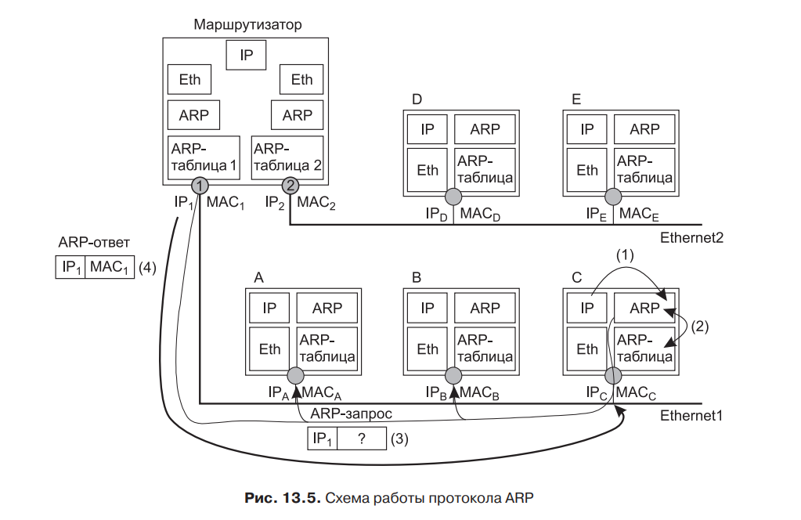

1) На первом шаге происходит передача от протокола IP протоколу ARP примерно такого сообщения: «Какой MAC-адрес имеет интерфейс с адресом IP1?» 
2) Работа протокола ARP начинается с просмотра собственной ARP-таблицы. Предположим, что среди содержащихся в ней записей отсутствует запрашиваемый IP-адрес.
3) В этом случае протокол ARP формирует ARP-запрос, вкладывает его в кадр протокола Ethernet и широковещательно рассылает. Заметим, что зона распространения ARP-запроса ограничивается сетью Ethernet1, так как на пути широковещательных кадров барьером стоит маршрутизатор.
4) Все интерфейсы сети Ethernet1 получают ARP-запрос и направляют его «своему» протоколу ARP. ARP сравнивает указанный в запросе адрес IP1 с IP-адресом собственного интерфейса. 
5) Протокол ARP, который констатировал совпадение (в данном случае это ARP интерфейса 1 маршрутизатора), формирует ARP-ответ, в котором маршрутизатор указывает локальный адрес MAC1, соответствующий адресу IP1 своего интерфейса, и отправляет его запрашивающему узлу (в данном примере узлу С).

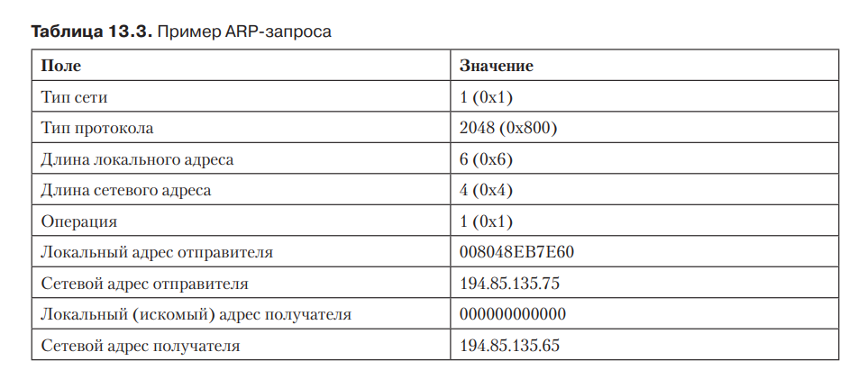

В поле типа сети для сетей Ethernet указывается значение 1. Поле типа протокола позволяет использовать протокол ARP не только с протоколом IP, но и с другими сетевыми протоколами. Для IP значение этого поля равно 0х0800. Длина локального адреса для протокола Ethernet равна 6 байт, а длина IP-адреса — 4 байта. В поле операции для ARPзапросов указывается значение 1, для ARP-ответов — значение 2. Из запроса видно, что в сети Ethernet узел с IP-адресом 194.85.135.75 пытается определить, какой MAC-адрес имеет другой узел той же сети, сетевой адрес которого 194.85.135.65. Поле искомого локального адреса заполнено нулями.

Ответ присылает узел, опознавший свой IP-адрес. Если в сети нет интерфейса с искомым IP-адресом, то ARP-ответа не будет. Протокол IP уничтожает IP-пакеты, направляемые по этому адресу. В табл. 13.4 показаны значения полей ARP-ответа, который мог бы поступить на приведенный в табл. 13.3 ARP-запрос.

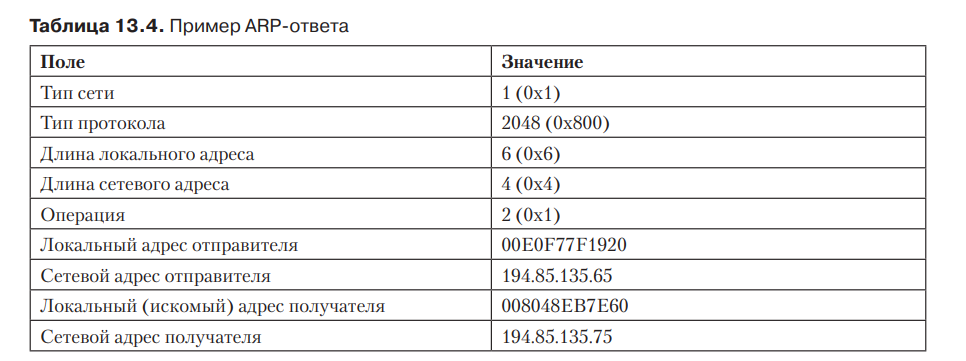

В результате обмена ARP-сообщениями модуль IP, пославший запрос с интерфейса, имеющего адрес 194.85.135.75, определил, что IP-адресу 194.85.135.65 соответствует MAC-адрес 00E0F77F1920. Теперь операция упаковки IP-пакета в кадр Ethernet может быть успешно завершена.

Чтобы уменьшить число ARP-обращений, запись о найденном соответствии между IPадресом и MAC-адресом сохраняется в ARP-таблице соответствующего интерфейса. Эта запись в ARP-таблице появляется автоматически, спустя несколько миллисекунд после того, как модуль ARP проанализирует ARP-ответ.

Протокол ARP, получив запрос, прежде всего просматривает свою ARP-таблицу и делает широковещательный запрос только в том случае, если в таблице нет записи о запрошенном адресе. ARP-таблица пополняется не только за счет поступающих на данный интерфейс ARP-ответов, но и в результате извлечения полезной информации из широковещательных ARP-запросов. Действительно, в каждом запросе, как это видно из таблиц 13.3 и 13.4, содержатся IP- и MAC-адреса отправителя. Все интерфейсы, получившие этот запрос, могут поместить информацию о соответствии локального и сетевого адресов отправителя в собственную ARP-таблицу.

В ARP-таблицах существуют два типа записей: динамические и статические. **Статические записи** создаются вручную с помощью утилиты arp и не имеют срока устаревания, точнее, они существуют до тех пор, пока компьютер или маршрутизатор остается включенным. **Динамические записи** должны периодически обновляться. Если запись не обновлялась в течение определенного времени (порядка нескольких минут), то она исключается из таблицы. Таким образом, в ARP-таблице содержатся записи не обо всех узлах сети, а только о тех, которые активно участвуют в сетевых операциях. Поскольку такой способ хранения информации называют кэшированием, ARP-таблицы иногда называют **ARP-кэшем**.

	Протокол Proxy-ARP — это разновидность протокола ARP, позволяющая отображать IP-адреса на аппаратные адреса в сетях, поддерживающих широковещание, даже в тех случаях, когда искомый узел находится за пределами данного домена коллизий.

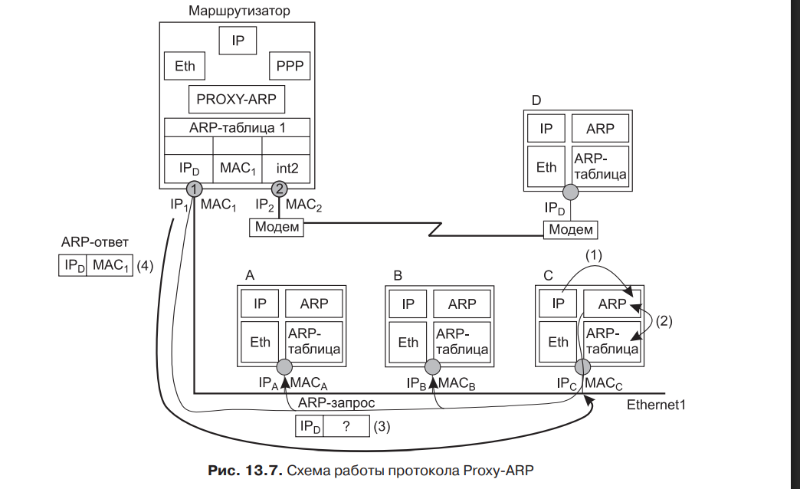

На рис. 13.7 показана сеть, один из конечных узлов которой (компьютер D) работает в режиме удаленного узла. В этом режиме узел обладает всеми возможностями компьютеров основной части сети Ethernet и, в частности, имеет IP-адрес (IPD), относящийся к той же сети. Для всех конечных узлов сети Ethernet особенности подключения удаленного узла (наличие модемов, коммутируемая связь, протокол PPP) абсолютно прозрачны — они взаимодействуют с ним обычным образом. Чтобы такой режим взаимодействия стал возможным, среди прочего необходим протокол Proxy-ARP. Поскольку удаленный узел подключен к сети по протоколу PPP, то он не имеет MAC-адреса.

#### Доменная служба имен DNS

**Доменная служба имен** (Domain Name Service, **DNS**) отображает символьные имена узлов сети на их IP-адреса (как IPv4, так и IPv6). Доменная служба имен является важной частью Интернета, но она может работать и в любой автономной IP-сети.

Существуют две основные схемы разрешения DNS-имен. В первом варианте, называемом **итеративной процедурой**, работу по поиску IP-адреса координирует DNS-клиент: он итеративно выполняет последовательность запросов к разным серверам имен. Рассмотрим эту процедуру на примере (рис. 13.9, а):

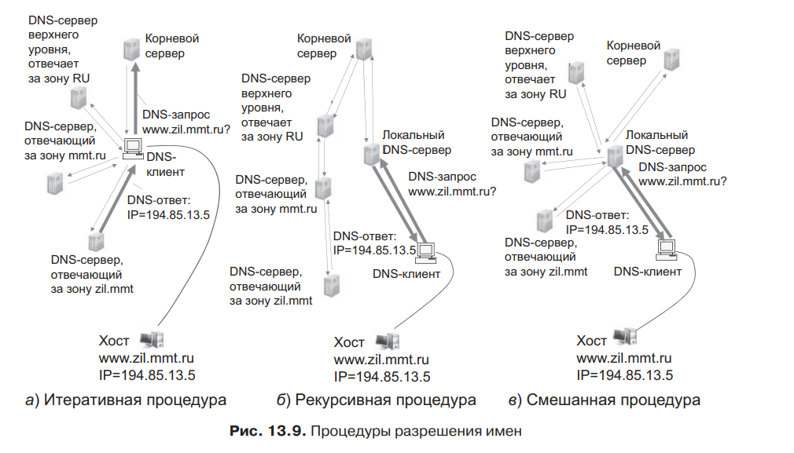

1. DNS-клиент обращается к корневому DNS-серверу с указанием полного доменного имени www.zil.mmt.ru хоста, для которого он хочет найти IP-адрес.
2. Корневой DNS-сервер отвечает клиенту, указывая адреса DNS-серверов верхнего уровня, обслуживающих домен, заданный в старшей части запрошенного имени, в данном случае — домен ru. 
3. DNS-клиент делает следующий запрос к одному из предложенных ему DNS-серверов верхнего уровня, который отсылает его к DNS-серверу нужного поддомена (в примере это сервер, отвечающий за зону mmt.ru), и так далее, пока не будет найден DNS-сервер, в котором хранится отображение запрошенного имени на IP-адрес. Этот сервер дает окончательный ответ клиенту, который теперь может установить связь с хостом по IP-адресу 194.85.13.5.

Во втором варианте (рис. 13.9, б) выполняется **рекурсивная процедура**. Здесь DNS-клиент перепоручает всю работу по разрешению имени цепочке DNS-серверов.

1. DNS-клиент отправляет запрос к локальному DNS-серверу, то есть серверу, обслуживающему поддомен, которому принадлежит имя клиента. 
2. Если локальный DNS-сервер знает ответ, то он сразу же возвращает его клиенту. Это может быть полномочный ответ (запрошенное имя входит в тот же поддомен, что и имя клиента) или неполномочный ответ (сервер уже узнавал данное соответствие для другого клиента и сохранил его в своем кэше). 
3. Если локальный DNS-сервер не знает ответа, то он обращается к корневому серверу, который переправляет запрос к DNS-серверу верхнего уровня (отвечающему за зону RU), который в свою очередь запрашивает нижележащий сервер (зона mmt), и так далее, пока запрос не дойдет до полномочного сервера, имеющего в своем файле зоны запись о запрошенном имени.
4. DNS-ответ полномочного сервера проходит тот же путь по цепочке DNS-серверов в обратном направлении, пока не достигнет DNS-клиента, породившего данный запрос.

В третьем варианте (рис. 13.9, в) реализуется смешанная процедура, включающая рекурсивную и итеративную фазы: 

1. Начальная часть процедуры, когда DNS-клиент передает запрос локальному DNSсерверу и поручает ему действовать от его имени, является рекурсивной. 
2. Затем, если локальный DNS-сервер не знает ответ, то он последовательно выполняет итеративные запросы к иерархии серверов точно так же, как это делал DNS-клиент в первом варианте. Получив ответ, локальный DNS-сервер передает его клиенту. 

DNS-серверы стараются не поддерживать рекурсивный режим ответов, так как это перегружает их; корневые серверы и серверы верхнего уровня всегда дают нерекурсивные ответы, отсылая серверы нижних уровней к серверам промежуточных уровней. Получая окончательный ответ от сервера вышестоящего уровня, рекурсивный сервер кэширует его для того, чтобы при поступлении аналогичного запроса дать быстрый неполномочный ответ. Чтобы служба DNS могла оперативно отрабатывать изменения, происходящие в сети, ответы кэшируются на относительно короткое время — обычно от нескольких часов до нескольких дней (срок задается администратором полномочного сервера). DNS-сервер может быть открытым (в этом случае он отвечает любому клиенту) или закрытым (в этом случае он отвечает либо только клиентам своего предприятия (в случае корпоративного сервера), либо только своим подписчикам услуг доступа в Интернет (в случае провайдера)).

#### Протокол DHCP

Для нормальной работы сети каждому сетевому интерфейсу компьютера и маршрутизатора должен быть назначен IP-адрес.

Процедура присвоения адресов происходит в ходе **конфигурирования** компьютеров и маршрутизаторов. Назначение IP-адресов может происходить вручную в результате выполнения процедуры конфигурирования интерфейса, для компьютера сводящейся, например, к заполнению системы экранных форм. При этом администратор должен помнить, какие адреса из имеющегося множества он уже использовал для других интерфейсов, а какие еще свободны. При конфигурировании помимо IP-адресов сетевых интерфейсов (и соответствующих масок) устройству сообщается ряд других конфигурационных параметров. При конфигурировании администратор должен назначить клиенту не только IP-адрес, но и другие параметры стека TCP/IP, необходимые для его эффективной работы, например маску и IP-адрес маршрутизатора, предлагаемые по умолчанию, IP-адрес DNSсервера, доменное имя компьютера и т. п. Даже при не очень большом размере сети эта работа представляет для администратора утомительную процедуру.

**Протокол динамического конфигурирования хостов (Dynamic Host Configuration Protocol, DHCP**) автоматизирует процесс конфигурирования сетевых интерфейсов, гарантируя от дублирования адресов за счет централизованного управления их распределением.

Протокол DHCP работает в соответствии с моделью клиент-сервер. Во время старта ОС компьютер, являющийся DHCP-клиентом, посылает в сеть широковещательный запрос на получение IP-адреса. DHCP-сервер откликается и посылает сообщение-ответ, содержащее IP-адрес и ряд других конфигурационных параметров. При этом DHCP-сервер может работать в разных режимах, включая: 

* ручное назначение статических адресов; 
* автоматическое назначение статических адресов; 
* автоматическое распределение динамических адресов. 

Во всех режимах работы администратор при конфигурировании DHCP-сервера сообщает ему один или несколько диапазонов IP-адресов, причем все эти адреса относятся к одной сети, то есть имеют одно и то же значение в поле номера сети. 

В ручном режиме администратор, помимо пула доступных адресов, снабжает DHCP-сервер информацией о жестком соответствии IP-адресов физическим адресам или другим идентификаторам клиентских узлов. DHCP-сервер, пользуясь этой информацией, всегда выдаст определенному DHCP-клиенту один и тот же назначенный ему администратором IP-адрес.

В режиме **автоматического** назначения статических адресов DHCP-сервер самостоятельно, без вмешательства администратора произвольным образом выбирает клиенту IP-адрес из пула наличных IP-адресов. Адрес дается клиенту из пула в постоянное пользование, то есть между идентифицирующей информацией клиента и его IP-адресом по-прежнему, как и при ручном назначении, существует постоянное соответствие. Оно устанавливается в момент первого назначения DHCP-сервером IP-адреса клиенту. При последующих запросах сервер возвращает клиенту тот же самый IP-адрес.

При **динамическом** распределении адресов DHCP-сервер выдает адрес клиенту на ограниченное время, называемое **сроком аренды**. Когда компьютер, являющийся DHCPклиентом, удаляется из подсети, назначенный ему IP-адрес автоматически освобождается. Когда компьютер подключается к другой подсети, то ему автоматически назначается новый адрес. Ни пользователь, ни сетевой администратор не вмешиваются в этот процесс. Это дает возможность впоследствии повторно использовать этот IP-адрес для назначения другому компьютеру. Таким образом, помимо основного преимущества DHCP — автоматизации рутинной работы администратора по конфигурированию стека TCP/IP на каждом компьютере, режим динамического распределения адресов в принципе позволяет строить IP-сеть, количество узлов в которой превышает количество имеющихся в распоряжении администратора IP-адресов.

Администратор управляет процессом конфигурирования сети, определяя два основных конфигурационных параметра DHCP-сервера: пул адресов, доступных распределению, и срок аренды. Срок аренды диктует, как долго компьютер может использовать назначенный IP-адрес, перед тем как снова запросить его у DHCP-сервера. Срок аренды зависит от режима работы пользователей сети. Если это небольшая сеть учебного заведения, куда со своими компьютерами приходят многочисленные студенты для выполнения лабораторных работ, то срок аренды может быть равен длительности лабораторной работы. Если же это корпоративная сеть, в которой сотрудники предприятия работают на регулярной основе, то срок аренды может быть достаточно длительным — несколько дней или даже недель. 

DHCP-сервер должен находиться в одной подсети с клиентами, учитывая, что клиенты посылают ему широковещательные запросы (рис. 13.11). Для снижения риска выхода сети из строя из-за отказа DHCP-сервера в сети иногда ставят резервный DHCP-сервер (такой вариант соответствует сети 1).

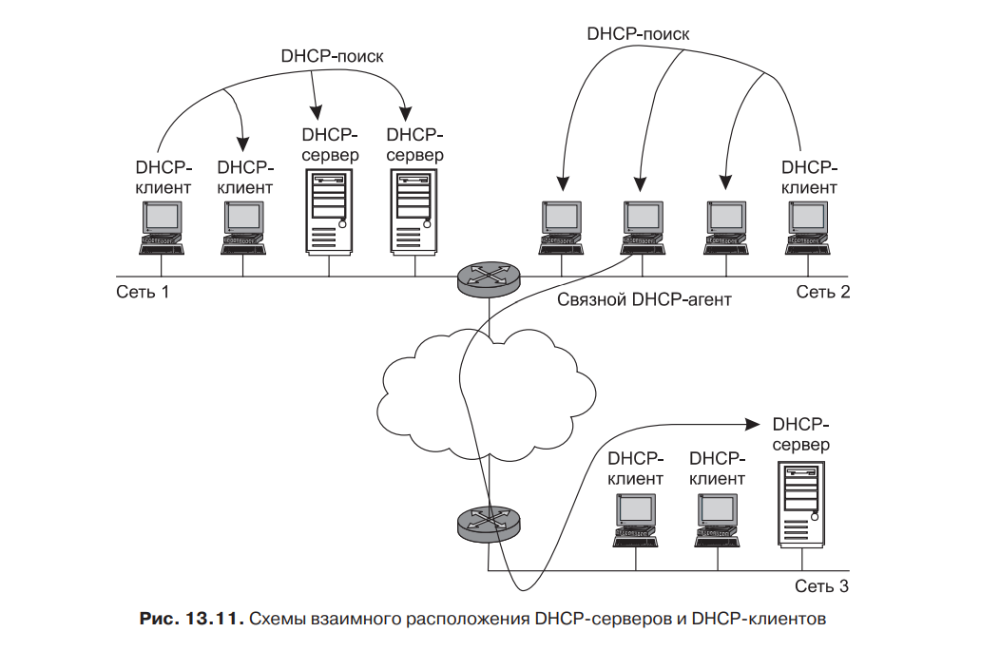

Иногда наблюдается и обратная картина: в сети нет ни одного DHCP-сервера. В этом случае его подменяет связной DHCP-агент — программное обеспечение, играющее роль посредника между DHCP-клиентами и DHCP-серверами (пример такого варианта — сеть 2). Связной агент переправляет запросы клиентов из сети 2 DHCP-серверу сети 3. Таким образом, один DHCP-сервер может обслуживать DHCP-клиентов нескольких разных сетей. Вот как выглядит упрощенная схема обмена сообщениями между клиентскими и серверными частями DHCP.

1. Когда компьютер включают, установленный на нем DHCP-клиент посылает ограниченное широковещательное сообщение DHCP-поиска (IP-пакет с адресом назначения, состоящим из одних единиц, который должен быть доставлен всем узлам данной IPсети). 
2. Находящиеся в сети DHCP-серверы получают это сообщение. Если в сети DHCPсерверы отсутствуют, то сообщение DHCP-поиска получает связной DHCP-агент. Он пересылает это сообщение в другую, возможно, значительно отстоящую от него сеть DHCP-серверу, IP-адрес которого ему заранее известен. 
3. Все DHCP-серверы, получившие сообщение DHCP-поиска, посылают DHCP-клиенту, обратившемуся с запросом, свои DHCP-предложения. Каждое предложение содержит IP-адрес и другую конфигурационную информацию. (DHCP-сервер, находящийся в другой сети, посылает ответ через агента.) 
4. DHCP-клиент собирает конфигурационные DHCP-предложения от всех DHCPсерверов. Как правило, он выбирает первое из поступивших предложений и отправляет в сеть широковещательный DHCP-запрос. В этом запросе содержатся идентификационная информация о DHCP-сервере, предложение которого принято, а также значения принятых конфигурационных параметров. 
5. Все DHCP-серверы получают DHCP-запрос и только один выбранный DHCP-сервер посылает положительную DHCP-квитанцию (подтверждение IP-адреса и параметров аренды), а остальные серверы аннулируют свои предложения, в частности, возвращают в свои пулы предложенные адреса. 
6. DHCP-клиент получает положительную DHCP-квитанцию и переходит в рабочее состояние.

Время от времени компьютер пытается обновить параметры аренды у DHCP-сервера. Первую попытку он делает задолго до истечения срока аренды, обращаясь к тому серверу, от которого он получил текущие параметры. Если ответа нет или ответ отрицательный, то он через некоторое время снова посылает запрос. Так повторяется несколько раз, и если все попытки получить параметры у того же сервера оказываются безуспешными, то клиент обращается к другому серверу. Если и другой сервер отвечает отказом, то клиент теряет свои конфигурационные параметры и переходит в режим автономной работы. Также DHCP-клиент может по своей инициативе досрочно отказаться от выделенных ему параметров.

### Глава 14. Протокол межсетевого взаимодействия IP

#### IP-пакет

В каждой очередной сети, лежащей на пути перемещения пакета, протокол IP обращается к средствам транспортировки этой сети, чтобы с их помощью передать пакет на маршрутизатор, ведущий к следующей сети, или непосредственно на узел-получатель. Поддержание интерфейса с нижележащими технологиями подсетей является одной из важнейших функций протокола IP. В эти функции входит также поддержание интерфейса с протоколами вышележащего транспортного уровня, в частности с протоколом TCP, который решает все вопросы обеспечения надежной доставки данных по составной сети в стеке TCP/IP.

Протокол IP относится к протоколам без установления соединений, поддерживая обработку каждого IP-пакета как независимой единицы обмена, не связанной с другими пакетами. В протоколе IP нет механизмов, обычно применяемых для обеспечения достоверности конечных данных. Если во время продвижения пакета происходит какая-либо ошибка, то протокол IP по своей инициативе ничего не предпринимает для ее исправления. Например, если на промежуточном маршрутизаторе пакет был отброшен из-за ошибки по контрольной сумме, то модуль IP не пытается заново послать потерянный пакет. Другими словами, протокол IP реализует политику доставки «по возможности».

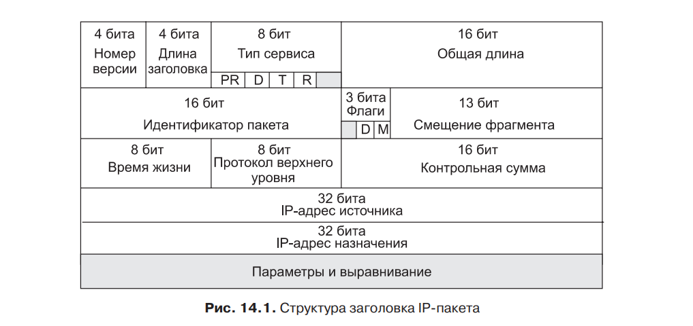

Поле **номера версии** занимает 4 бита и идентифицирует версию протокола IP. Сейчас повсеместно используется версия 4 (IPv4), хотя все чаще встречается и новая версия (IPv6). Значение **длины заголовка** IP-пакета также занимает 4 бита и измеряется в 32-битных словах. Обычно заголовок имеет длину в 20 байт (пять 32-битных слов), но при добавлении некоторой служебной информации это значение может быть увеличено за счет дополнительных байтов в поле параметров. Наибольшая длина заголовка составляет 60 байт.

Поле **типа сервиса** (Type of Service, ToS) имеет и другое, более современное название — байт дифференцированного обслуживания, или DS-байт. Этим двум названиям соответствуют два варианта интерпретации этого поля. В обоих случаях данное поле служит одной цели — хранению признаков, отражающих требования к качеству обслуживания пакета. В прежнем варианте первые три бита содержат значение приоритета пакета: от самого низкого — 0 до самого высокого — 7. Маршрутизаторы и компьютеры могут принимать во внимание приоритет пакета и обрабатывать более важные пакеты в первую очередь.

Следующие три бита поля ToS определяют **критерий выбора маршрута**. Если для бита D (Delay — задержка) установлено значение 1, то маршрут должен выбираться для минимизации задержки доставки данного пакета, установленный бит T (Throughput — пропускная способность) — для максимизации пропускной способности, а бит R (Reliability — надежность) — для максимизации надежности доставки. Оставшиеся два бита имеют нулевое значение.

Поле **общей длины** занимает 2 байта и характеризует общую длину пакета с учетом заголовка и поля данных. Максимальная длина пакета ограничена разрядностью поля, определяющего эту величину, и составляет 65 535 байт, но в большинстве компьютеров и сетей столь большие пакеты не используются. При передаче по сетям различного типа длина пакета выбирается с учетом максимальной длины пакета протокола нижнего уровня, несущего IP-пакеты. Если это кадры Ethernet, то выбираются пакеты с максимальной длиной 1500 байт, умещающиеся в поле данных кадра Ethernet. В стандартах TCP/IP предусматривается, что все хосты должны быть готовы принимать пакеты длиной вплоть до 576 байт (независимо от того, приходят они целиком или фрагментами).

**Идентификатор пакета** занимает 2 байта и используется для распознавания пакетов, образовавшихся путем деления на части (фрагментации) исходного пакета. Все части (фрагменты) одного пакета должны иметь одинаковое значение этого поля.

**Флаги** занимают 3 бита и содержат признаки, связанные с фрагментацией. Установленный в 1 бит DF (Do not Fragment — не фрагментировать) запрещает маршрутизатору фрагментировать данный пакет, а установленный в 1 бит MF (More Fragments — больше фрагментов) говорит о том, что данный пакет является промежуточным (не последним) фрагментом. Оставшийся бит зарезервирован.

Поле **смещения фрагмента** занимает 13 бит и задает смещение в байтах поля данных этого фрагмента относительно начала поля данных исходного (нефрагментированного) пакета. Используется при сборке/разборке фрагментов пакетов. Смещение должно быть кратно 8 байтам.

Поле **времени жизни (Time To Live, TTL)** занимает один байт и используется для задания предельного срока, в течение которого пакет может перемещаться по сети. Время жизни пакета измеряется в секундах и задается источником. По истечении каждой секунды пребывания на каждом из маршрутизаторов, через которые проходит пакет во время своего «путешествия» по сети, из его текущего времени жизни вычитается единица; единица вычитается и в том случае, если время пребывания — менее секунды. Поскольку современные маршрутизаторы редко обрабатывают пакет дольше, чем за одну секунду, то время жизни можно интерпретировать как максимальное число транзитных узлов, которые разрешено пройти пакету. Если значение поля времени жизни становится нулевым до того, как пакет достигает получателя, то пакет уничтожается. Таким образом, время жизни является своего рода часовым механизмом самоуничтожения пакета.

Поле **протокола верхнего уровня** занимает 1 байт и содержит идентификатор, указывающий, какому протоколу верхнего уровня принадлежит информация, размещенная в поле данных пакета. Например, 6 означает, что в пакете находится сообщение протокола TCP, 17 — протокола UDP, 1 — протокола ICMP.

**Поля IP-адресов источника и приемника** имеют одинаковую длину — 32 бита.

Поле **параметров** является необязательным и используется обычно только при отладке сети. Это поле состоит из нескольких подполей одного из восьми предопределенных типов. В этих подполях можно указывать точный маршрут, по которому маршрутизаторы должны направлять данный пакет (то есть выполнять маршрутизацию от источника), регистрировать проходимые пакетом маршрутизаторы или помещать данные системы безопасности и временные отметки. Так как число подполей в поле параметров может быть произвольным, то в конце заголовка должно быть добавлено несколько нулевых байтов для выравнивания заголовка пакета по 32-битной границе.

#### Просмотр таблиц маршрутизации без масок

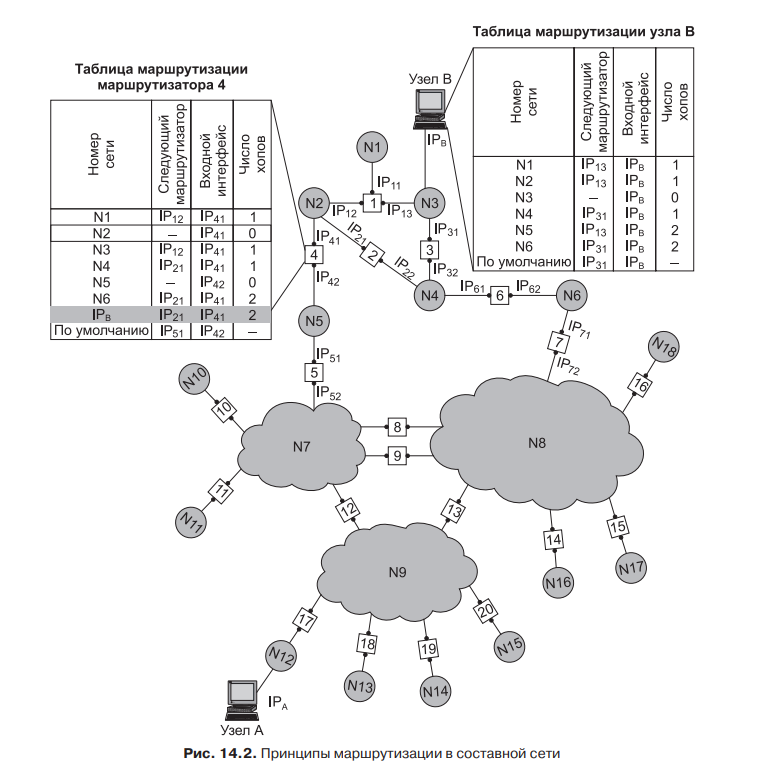

Рассмотрим алгоритм просмотра таблицы маршрутизации протоколом IP, используя данные из табл. 14.1 и рис. 14.2. Пусть на один из интерфейсов маршрутизатора поступает пакет. Протокол IP извлекает из пакета IP-адрес назначения (предположим, адрес назначения IPB).

1. Выполняется первая фаза просмотра таблицы — поиск специфического маршрута к узлу. IP-адрес (целиком) последовательно, строка за строкой, сравнивается с содержимым поля адреса назначения таблицы маршрутизации. Если произошло совпадение (как в табл. 14.1), то из соответствующей строки извлекаются адрес следующего маршрутизатора (IP21) и идентификатор выходного интерфейса (IP41). На этом просмотр таблицы заканчивается. 
2. Предположим теперь, что в таблице нет строки с адресом назначения IPB, а значит, совпадения не произошло. В этом случае протокол IP переходит ко второй фазе просмотра — поиску маршрута к сети назначения. Из IP-адреса выделяется номер сети (в нашем примере из адреса IPB выделяется номер сети N3), после чего таблица снова просматривается на предмет совпадения номера сети в какой-либо строке с номером сети из пакета. При совпадении (а в нашем примере оно произошло) из соответствующей строки таблицы извлекаются адрес следующего маршрутизатора (IP12) и идентификатор выходного интерфейса (IP41). Просмотр таблицы на этом завершается. 
3. Наконец, предположим, что адрес назначения в пакете был таков, что совпадения не произошло ни в первой, ни во второй фазах просмотра. В таком случае средствами протокола IP либо выбирается маршрут по умолчанию (и пакет направляется по адресу IP51), либо, если маршрут по умолчанию отсутствует, пакет отбрасывается. Просмотр таблицы на этом заканчивается.

		Последовательность фаз в данном алгоритме строго определена, в то время как последовательность просмотра или, что одно и то же, порядок расположения строк в таблице, включая запись о маршруте по умолчанию, никак не сказывается на результате.

#### Источники и типы записей в таблице маршрутизации

Практически для всех маршрутизаторов существуют три основных источника записей в таблице.

Во-первых, это **программное обеспечение** стека TCP/IP, которое при инициализации маршрутизатора автоматически заносит в таблицу несколько записей, в результате чего создается так называемая минимальная таблица маршрутизации. Программное обеспечение формирует записи о непосредственно подключенных сетях и маршрутах по умолчанию, информация о которых появляется в стеке при ручном конфигурировании интерфейсов компьютера или маршрутизатора.

Во-вторых, источником записей в таблице является **администратор**, непосредственно формирующий записи с помощью некоторой системной утилиты, например программы route, доступной в ОС Unix и ОС Windows. В аппаратных маршрутизаторах также всегда имеется команда для ручного задания записей таблицы маршрутизации. Заданные вручную записи всегда являются статическими, то есть не имеют срока жизни. Эти записи могут быть как постоянными, то есть сохраняющимися при перезагрузке маршрутизатора, так и временными, хранящимися в таблице только до выключения устройства. Часто администратор вручную заносит запись о маршруте по умолчанию. Таким же образом в таблицу маршрутизации может быть внесена и запись о специфическом для узла маршруте.

И наконец, третьим источником записей могут быть **протоколы маршрутизации**, такие как RIP или OSPF. Эти записи всегда являются динамическими, то есть имеют ограниченный срок жизни.

#### Пример IP-маршрутизации без масок

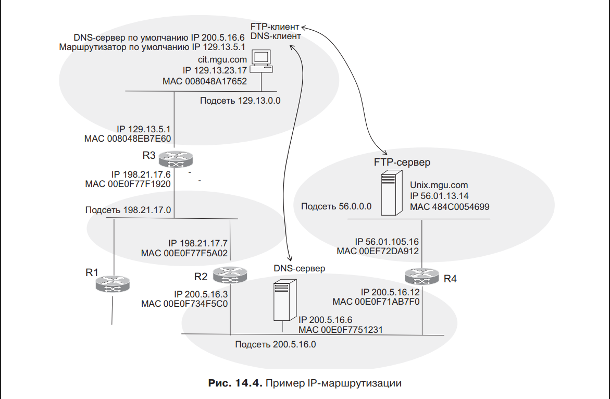

Рассмотрим процесс продвижения пакета в составной сети на примере IP-сети, показанной на рис. 14.4, исходя из того, что все узлы сети, рассматриваемой в примере, имеют адреса, основанные на классах. Особое внимание уделим взаимодействию протокола IP с протоколами разрешения адресов ARP и DNS.

Итак, пусть пользователю компьютера cit.mgu.com, находящегося в сети 129.13.0.0, необходимо установить связь с FTP-сервером. Пользователю известно символьное имя сервера unix.mgu.com, поэтому он набирает на клавиатуре команду обращения к FTP-серверу по имени:

	ftp unix.mgu.com

Выполнение этой команды инициирует три последовательные операции: 
1. DNS-клиент (работающий на компьютере cit.mgu.com) передает DNS-серверу сообщение, в котором содержится запрос об IP-адресе сервера unix.mgu.com, с которым он хочет связаться по протоколу FTP. 
2. DNS-сервер, выполнив поиск, передает ответ DNS-клиенту о найденном IP-адресе сервера unix.mgu.com. 
3. FTP-клиент (работающий на том же компьютере cit.mgu.com), используя найденный IP-адрес сервера unix.mgu.com, передает ему сообщение.

Давайте последовательно, по шагам, рассмотрим, как при решении этих задач взаимодействуют между собой протоколы DNS, IP, ARP и Ethernet и что происходит при этом с кадрами и пакетами.

*Формирование IP-пакета с инкапсулированным в него DNS-запросом*. Программный модуль FTP-клиента, получив команду > ftp unix.mgu.com, делает запрос к работающему на этом же компьютере DNS-клиенту, который формирует запрос к DNS-серверу: «Какой IP-адрес соответствует имени unix.mgu.com?» Запрос упаковывается в UDP-дейтаграмму, затем в IP-пакет. В заголовке пакета в качестве адреса назначения указывается IP-адрес 200.5.16.6 DNS-сервера, который входит в число конфигурационных параметров хоста.

*Передача кадра Ethernet с IP-пакетом маршрутизатору R3*. Для передачи этого IP-пакета необходимо его упаковать в кадр Ethernet, указав в заголовке MAC-адрес получателя. Технология Ethernet способна доставлять кадры только тем адресатам, которые находятся в пределах одной подсети с отправителем. Если же адресат расположен вне этой подсети, то кадр надо передать ближайшему маршрутизатору, чтобы тот взял на себя заботу о дальнейшем перемещении пакета. Модуль IP, сравнив номера сетей в адресах отправителя и получателя, то есть 129.13.23.17 и 200.5.16.6, выясняет, что пакет направляется в другую сеть, следовательно, его необходимо передать маршрутизатору, в данном случае маршрутизатору по умолчанию. IP-адрес маршрутизатора по умолчанию также известен клиентскому узлу, поскольку он входит в число конфигурационных параметров. Однако в кадре Ethernet необходимо указать не IP-адрес, а MAC-адрес получателя. Эта проблема решается с помощью протокола ARP, который для ответа на вопрос «Какой MAC-адрес соответствует IP-адресу 129.13.5.1?» делает поиск в своей ARP-таблице. Поскольку обращения к маршрутизатору происходят часто, будем считать, что нужный MAC-адрес обнаруживается в таблице и имеет значение 008048EB7E60. После получения этой информации клиентский компьютер cit.mgu.com отправляет маршрутизатору R3 кадр Ethernet с DNS-запросом (рис. 14.5).

*Определение IP-адреса и MAC-адреса следующего маршрутизатора R2*. Кадр принимается интерфейсом 129.13.5.1 маршрутизатора R3. Протокол Ethernet, работающий на этом интерфейсе, извлекает из этого кадра IP-пакет и передает его протоколу IP. Протокол IP находит в заголовке пакета адрес назначения 200.5.16.6 и просматривает записи своей таблицы маршрутизации. Пусть маршрутизатор R3 не обнаруживает специфического маршрута для адреса назначения 200.5.16.6, но находит в своей таблице следующую запись: 
	
	200.5.16.0 198.21.17.7 198.21.17.6

Эта запись говорит о том, что пакеты для сети 200.5.16.0 маршрутизатор R3 должен передавать на свой выходной интерфейс 198.21.17.6, с которого они поступят на интерфейс следующего маршрутизатора R2, имеющего IP-адрес 198.21.17.7. Далее протокол ARP определяет MAC-адрес маршрутизатора R2. Пусть на этот раз в ARP-таблице нет записи об адресе маршрутизатора R2. Тогда в сеть отправляется широковещательный ARP-запрос, поступающий на все интерфейсы сети 198.21.17.0. Ответ приходит только от интерфейса маршрутизатора R2: «Я имею IP-адрес 198.21.17.7, и мой MAC-адрес 00E0F77F5A02». Зная MAC-адрес маршрутизатора R2 (00E0F77F5A02), маршрутизатор R3 передает ему IP-пакет с DNS-запросом (рис. 14.6).

%Маршрутизатор R2 доставляет пакет DNS-серверу%. Для этого модуль IP на маршрутизаторе R2 извлекает из пакета IP-адрес назначения и, просматривая свою таблицу маршрутизации, обнаруживает, что сеть назначения 200.5.16.0 является непосредственно присоединенной к его второму интерфейсу. Следовательно, пакет не нужно маршрутизировать, однако требуется определить MAC-адрес узла назначения. Протокол ARP «по просьбе» протокола IP находит (либо в ARP-таблице, либо широковещательно) MAC-адрес 00E0F7751231 DNS-сервера. Маршрутизатор R2 формирует кадр Ethernet с DNS-запросом (рис. 14.7) и передает его в сеть.

Сетевой адаптер DNS-сервера захватывает кадр Ethernet, обнаруживает совпадение MAC-адреса назначения, содержащегося в заголовке, со своим собственным адресом и направляет его вышележащим протоколам. DNS-запрос передается программному модулю DNS-сервера. DNS-сервер просматривает свои таблицы, возможно, обращается к другим DNS-серверам и в результате формирует ответ: «Символьному имени unix.mgu.com соответствует IP-адрес 56.01.13.14».

Процесс доставки DNS-ответа (рис. 14.8) клиенту cit.mgu.com аналогичен процессу передачи DNS-запроса, который мы только что так подробно описали. FTP-клиент, получив IP-адрес FTP-сервера, посылает ему свое сообщение.

#### Маршрутизация с использованием масок

Алгоритм просмотра таблиц маршрутизации с учетом масок, во многом подобный алгоритму просмотра таблиц без масок, имеет и ряд существенных отличий. Поиск следующего маршрутизатора для вновь поступившего IP-пакета протокол начинает с того, что извлекает из пакета адрес назначения (обозначим его IPD). Затем протокол IP приступает к процедуре просмотра таблицы маршрутизации, также состоящей из двух фаз, как и процедура просмотра таблицы, в которой столбец маски отсутствует.

1. *Первая фаза* состоит в поиске специфического маршрута для адреса IPD. С этой целью из каждой записи таблицы, в которой маска имеет значение 255.255.255.255, извлекается адрес назначения и сравнивается с адресом из пакета IPD. Если в какой-либо строке совпадение произошло, то адрес следующего маршрутизатора для данного пакета берется из данной строки. 
2. *Вторая фаза* выполняется только в том случае, если во время первой фазы не произошло совпадения адресов. Она состоит в поиске неспецифического маршрута, общего для группы узлов, к которой относится и пакет с адресом IPD. Для этого средствами IP заново просматривается таблица маршрутизации, причем с каждой записью производятся следующие действия:

* маска (обозначим ее M), содержащаяся в данной записи, «накладывается» на IPадрес узла назначения IPD, извлеченный из пакета: IPD AND M; 
* полученное в результате число сравнивается со значением, которое помещено в поле адреса назначения той же записи таблицы маршрутизации; 
* если происходит совпадение, то протокол IP соответствующим образом отмечает эту строку; 
* если просмотрены не все строки, то протокол IP аналогичным образом просматривает следующую строку, если все (включая строку о маршруте по умолчанию), то просмотр записей заканчивается и происходит переход к следующему шагу.

1. После просмотра всей таблицы маршрутизатор выполняет одно их трех действий: 

* если не произошло ни одного совпадения и маршрут по умолчанию отсутствует, то пакет отбрасывается; 
* если произошло одно совпадение, то пакет отправляется по маршруту, указанному в строке с совпавшим адресом; 
* если произошло несколько совпадений, то все помеченные строки сравниваются и выбирается маршрут из той строки, в которой количество совпавших двоичных разрядов наибольшее (другими словами, в ситуации, когда адрес назначения пакета принадлежит сразу нескольким подсетям, маршрутизатор использует наиболее специфический маршрут).

#### Фрагментация IP-пакетов

Важной особенностью протокола IP, отличающей его от других сетевых протоколов (например, от сетевого протокола IPX, который какое-то время назад конкурировал с IP), является его способность выполнять динамическую фрагментацию пакетов при передаче их между сетями с различными максимально допустимыми значениями длины поля данных кадров (Maximum Transmission Unit, **MTU**). Значения MTU зависят как от протокола, так и от настройки сетевых интерфейсов.

Прежде всего отметим разницу между фрагментацией сообщений в узле-отправителе и динамической фрагментацией сообщений в транзитных узлах сети — маршрутизаторах. В первом случае деление сообщения на несколько более мелких частей (фрагментация) происходит при передаче данных между протоколами стека в пределах одного и того же компьютера. Протоколы анализируют тип технологии нижнего уровня, определяют ее MTU и делят сообщения на части, умещающиеся в кадры канального уровня того же стека протоколов. В стеке TCP/IP эту задачу решает протокол TCP, который разбивает поток байтов, передаваемых ему с прикладного уровня, на сегменты нужного размера, например по 1460 байт, если на нижнем уровне данной сети работает протокол Ethernet. Протокол IP в узле-отправителе, как правило, не использует свои возможности по фрагментации пакетов. А вот на транзитном узле — маршрутизаторе, когда пакет необходимо передать из сети с большим значением MTU в сеть с меньшим значением MTU, способности протокола IP выполнять фрагментацию становятся востребованными. Пакеты-фрагменты, путешествуя по сети, могут вторично подвергнуться фрагментации на каком-либо из промежуточных маршрутизаторов.

Каждый из фрагментов снабжается полноценным заголовком IP. Для последующей сборки фрагментов в исходное сообщение используются следующие поля заголовка:

* **Идентификатор пакета** используется для распознавания пакетов, образовавшихся путем деления на части (фрагментации) исходного пакета. Все части (фрагменты) одного пакета должны иметь одинаковое значение этого поля. Модуль IP, отправляющий пакет, устанавливает в поле идентификатора значение, которое должно быть уникальным для данной пары отправителя и получателя в течение всего времени, пока данный пакет (или любой его фрагмент) может существовать в составной IP-сети. 

* **Поле времени жизни (Time To Live, TTL)** занимает один байт и определяет предельный срок, в течение которого пакет может перемещаться по сети. Время жизни пакета измеряется в секундах и задается источником (отправителем). Как отмечено в начале этой главы, по истечении каждой секунды пребывания на каждом из маршрутизаторов, через которые проходит пакет во время своего «путешествия» по сети, из его текущего времени жизни вычитается единица; единица вычитается и в том случае, если время пребывания было меньше секунды. Поскольку современные маршрутизаторы редко обрабатывают пакет дольше чем за одну секунду, время жизни можно интерпретировать как максимальное число транзитных узлов, которые разрешено пройти пакету. Если значение поля времени жизни становится нулевым до того, как пакет достигает получателя, то пакет уничтожается. При сборке фрагментов хост-получатель использует значение TTL как крайний срок ожидания недостающих фрагментов. 

* Поле **смещения фрагмента** содержит информацию о положении фрагмента относительно начала поля данных исходного нефрагментированного пакета. Так, первый фрагмент будет иметь в поле смещения нулевое значение. В пакете, не разбитом на фрагменты, поле смещения также имеет нулевое значение. Смещение задается в байтах и должно быть кратно 8 байтам. 

* Установленный в единицу однобитный флаг **MF** (More Fragments — больше фрагментов) говорит о том, что данный пакет является промежуточным (не последним) фрагментом. Модуль IP, отправляющий нефрагментированный пакет, устанавливает бит MF в нуль.

* Флаг **DF** (Do not Fragment — не фрагментировать), установленный в единицу, запрещает маршрутизатору фрагментировать данный пакет; если помеченный таким образом пакет не может достичь получателя без фрагментации, то модуль IP его уничтожает, а узлу-отправителю посылается диагностическое сообщение. Возможность запретить фрагментацию позволяет в некоторых случаях ускорить работу приложений. Для этого необходимо предварительно исследовать сеть, определить максимальный размер пакета, который сможет пройти весь путь без фрагментации, а затем использовать пакеты такого или меньшего размера.

#### Протокол ICMP

**Протокол межсетевых управляющих сообщений (Internet Control Message Protocol, ICMP)** является вспомогательным протоколом, использующимся для диагностики и мониторинга сети.

Можно представить ряд ситуаций, когда протокол IP не может доставить пакет адресату — например, истекает время жизни пакета, в таблице маршрутизации отсутствует маршрут к заданному в пакете адресу назначения, пакет не проходит проверку по контрольной сумме, шлюз не имеет достаточно места в своем буфере для передачи какого-либо пакета и т. д., и т. п. Свойство «необязательности» протокола IP, доставляющего данные «по возможности», компенсируется протоколами более высоких уровней стека TCP/IP, например TCP на транспортном уровне и в какой-то степени DNS на прикладном уровне. Они берут на себя обязанности по обеспечению надежности, применяя такие известные приемы, как нумерация сообщений, подтверждение доставки, повторная посылка данных.

Протокол ICMP также призван компенсировать ненадежность протокола IP, но несколько иным образом. Он не предназначен для исправления возникших при передаче пакета проблем: если пакет потерян, то ICMP не может послать его заново. Задача ICMP другая — он является средством оповещения отправителя о «несчастных случаях», произошедших с его пакетами. Пусть, например, протокол IP, работающий на каком-либо маршрутизаторе, обнаружил, что пакет для дальнейшей передачи по маршруту необходимо фрагментировать, но в пакете установлен признак DF (не фрагментировать). В таком случае протокол IP, прежде чем отбросить пакет, отправляет диагностическое ICMP-сообщение конечному узлу-источнику. ICMP-сообщение передается по сети в поле данных IP-пакета. IP-адрес узла-источника определяется из заголовка исходного пакета, вызвавшего инцидент.

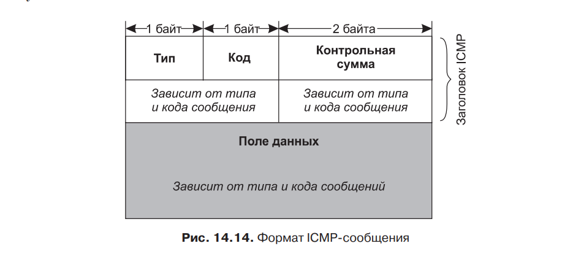

Заголовок ICMP-сообщения состоит из 8 байт: 

* тип (1 байт) — числовой идентификатор типа сообщения; 
* код (1 байт) — числовой идентификатор, более тонко дифференцирующий тип ошибки; 
* контрольная сумма (2 байта) — подсчитывается для всего ICMP-сообщения.

Содержимое оставшихся 4 байт в заголовке и поле данных зависит от значений полей типа и кода.

